## Project : *UCPvax*

## Script author : *Babacar Ndao*

# scRNA-seq Analysis with *Seurat*

# UCPvax <font color='#AED6F1'>BASELINE</font> , <font color='#2E86C1'>FT</font> , <font color='#2D86C1'>S3</font>- time point

# Analysis the subset of CD4 T Cells from PBMC


```R
#### *Set Environment Variables*
Sys.setenv(HOME="/Work/Users/bndao")
```

#### Be sur that the following packages are installed on your system
#### If not, installe them


```R
# Libraries Loading
suppressMessages(library(Seurat))
suppressMessages(library(patchwork))
suppressMessages(lapply(c("RColorBrewer","plyr","grid","gridExtra","cowplot","pals","reshape"), library, character.only = T))
suppressMessages(lapply(c("Matrix","patchwork","ggplot2","dplyr","tidyverse","openxlsx"), library, character.only = T))
suppressMessages(library(ggrepel))
suppressMessages(library(stringr))
suppressMessages(library(ggpubr))  # state_compare_means
suppressMessages(library(ggstatsplot)) # Visualizations with statistical details
suppressMessages(library(PMCMRplus)) # Visualizations with statistical details
suppressMessages(library(rstatix))  # statistical details
```


<ol>
	<li><style>
.list-inline {list-style: none; margin:0; padding: 0}
.list-inline>li {display: inline-block}
.list-inline>li:not(:last-child)::after {content: "\00b7"; padding: 0 .5ex}
</style>
<ol class=list-inline><li>'RColorBrewer'</li><li>'patchwork'</li><li>'SeuratObject'</li><li>'Seurat'</li><li>'stats'</li><li>'graphics'</li><li>'grDevices'</li><li>'utils'</li><li>'datasets'</li><li>'methods'</li><li>'base'</li></ol>
</li>
	<li><style>
.list-inline {list-style: none; margin:0; padding: 0}
.list-inline>li {display: inline-block}
.list-inline>li:not(:last-child)::after {content: "\00b7"; padding: 0 .5ex}
</style>
<ol class=list-inline><li>'plyr'</li><li>'RColorBrewer'</li><li>'patchwork'</li><li>'SeuratObject'</li><li>'Seurat'</li><li>'stats'</li><li>'graphics'</li><li>'grDevices'</li><li>'utils'</li><li>'datasets'</li><li>'methods'</li><li>'base'</li></ol>
</li>
	<li><style>
.list-inline {list-style: none; margin:0; padding: 0}
.list-inline>li {display: inline-block}
.list-inline>li:not(:last-child)::after {content: "\00b7"; padding: 0 .5ex}
</style>
<ol class=list-inline><li>'grid'</li><li>'plyr'</li><li>'RColorBrewer'</li><li>'patchwork'</li><li>'SeuratObject'</li><li>'Seurat'</li><li>'stats'</li><li>'graphics'</li><li>'grDevices'</li><li>'utils'</li><li>'datasets'</li><li>'methods'</li><li>'base'</li></ol>
</li>
	<li><style>
.list-inline {list-style: none; margin:0; padding: 0}
.list-inline>li {display: inline-block}
.list-inline>li:not(:last-child)::after {content: "\00b7"; padding: 0 .5ex}
</style>
<ol class=list-inline><li>'gridExtra'</li><li>'grid'</li><li>'plyr'</li><li>'RColorBrewer'</li><li>'patchwork'</li><li>'SeuratObject'</li><li>'Seurat'</li><li>'stats'</li><li>'graphics'</li><li>'grDevices'</li><li>'utils'</li><li>'datasets'</li><li>'methods'</li><li>'base'</li></ol>
</li>
	<li><style>
.list-inline {list-style: none; margin:0; padding: 0}
.list-inline>li {display: inline-block}
.list-inline>li:not(:last-child)::after {content: "\00b7"; padding: 0 .5ex}
</style>
<ol class=list-inline><li>'cowplot'</li><li>'gridExtra'</li><li>'grid'</li><li>'plyr'</li><li>'RColorBrewer'</li><li>'patchwork'</li><li>'SeuratObject'</li><li>'Seurat'</li><li>'stats'</li><li>'graphics'</li><li>'grDevices'</li><li>'utils'</li><li>'datasets'</li><li>'methods'</li><li>'base'</li></ol>
</li>
	<li><style>
.list-inline {list-style: none; margin:0; padding: 0}
.list-inline>li {display: inline-block}
.list-inline>li:not(:last-child)::after {content: "\00b7"; padding: 0 .5ex}
</style>
<ol class=list-inline><li>'pals'</li><li>'cowplot'</li><li>'gridExtra'</li><li>'grid'</li><li>'plyr'</li><li>'RColorBrewer'</li><li>'patchwork'</li><li>'SeuratObject'</li><li>'Seurat'</li><li>'stats'</li><li>'graphics'</li><li>'grDevices'</li><li>'utils'</li><li>'datasets'</li><li>'methods'</li><li>'base'</li></ol>
</li>
	<li><style>
.list-inline {list-style: none; margin:0; padding: 0}
.list-inline>li {display: inline-block}
.list-inline>li:not(:last-child)::after {content: "\00b7"; padding: 0 .5ex}
</style>
<ol class=list-inline><li>'reshape'</li><li>'pals'</li><li>'cowplot'</li><li>'gridExtra'</li><li>'grid'</li><li>'plyr'</li><li>'RColorBrewer'</li><li>'patchwork'</li><li>'SeuratObject'</li><li>'Seurat'</li><li>'stats'</li><li>'graphics'</li><li>'grDevices'</li><li>'utils'</li><li>'datasets'</li><li>'methods'</li><li>'base'</li></ol>
</li>
</ol>


<ol>
	<li><style>
.list-inline {list-style: none; margin:0; padding: 0}
.list-inline>li {display: inline-block}
.list-inline>li:not(:last-child)::after {content: "\00b7"; padding: 0 .5ex}
</style>
<ol class=list-inline><li>'Matrix'</li><li>'reshape'</li><li>'pals'</li><li>'cowplot'</li><li>'gridExtra'</li><li>'grid'</li><li>'plyr'</li><li>'RColorBrewer'</li><li>'patchwork'</li><li>'SeuratObject'</li><li>'Seurat'</li><li>'stats'</li><li>'graphics'</li><li>'grDevices'</li><li>'utils'</li><li>'datasets'</li><li>'methods'</li><li>'base'</li></ol>
</li>
	<li><style>
.list-inline {list-style: none; margin:0; padding: 0}
.list-inline>li {display: inline-block}
.list-inline>li:not(:last-child)::after {content: "\00b7"; padding: 0 .5ex}
</style>
<ol class=list-inline><li>'Matrix'</li><li>'reshape'</li><li>'pals'</li><li>'cowplot'</li><li>'gridExtra'</li><li>'grid'</li><li>'plyr'</li><li>'RColorBrewer'</li><li>'patchwork'</li><li>'SeuratObject'</li><li>'Seurat'</li><li>'stats'</li><li>'graphics'</li><li>'grDevices'</li><li>'utils'</li><li>'datasets'</li><li>'methods'</li><li>'base'</li></ol>
</li>
	<li><style>
.list-inline {list-style: none; margin:0; padding: 0}
.list-inline>li {display: inline-block}
.list-inline>li:not(:last-child)::after {content: "\00b7"; padding: 0 .5ex}
</style>
<ol class=list-inline><li>'ggplot2'</li><li>'Matrix'</li><li>'reshape'</li><li>'pals'</li><li>'cowplot'</li><li>'gridExtra'</li><li>'grid'</li><li>'plyr'</li><li>'RColorBrewer'</li><li>'patchwork'</li><li>'SeuratObject'</li><li>'Seurat'</li><li>'stats'</li><li>'graphics'</li><li>'grDevices'</li><li>'utils'</li><li>'datasets'</li><li>'methods'</li><li>'base'</li></ol>
</li>
	<li><style>
.list-inline {list-style: none; margin:0; padding: 0}
.list-inline>li {display: inline-block}
.list-inline>li:not(:last-child)::after {content: "\00b7"; padding: 0 .5ex}
</style>
<ol class=list-inline><li>'dplyr'</li><li>'ggplot2'</li><li>'Matrix'</li><li>'reshape'</li><li>'pals'</li><li>'cowplot'</li><li>'gridExtra'</li><li>'grid'</li><li>'plyr'</li><li>'RColorBrewer'</li><li>'patchwork'</li><li>'SeuratObject'</li><li>'Seurat'</li><li>'stats'</li><li>'graphics'</li><li>'grDevices'</li><li>'utils'</li><li>'datasets'</li><li>'methods'</li><li>'base'</li></ol>
</li>
	<li><style>
.list-inline {list-style: none; margin:0; padding: 0}
.list-inline>li {display: inline-block}
.list-inline>li:not(:last-child)::after {content: "\00b7"; padding: 0 .5ex}
</style>
<ol class=list-inline><li>'lubridate'</li><li>'forcats'</li><li>'stringr'</li><li>'purrr'</li><li>'readr'</li><li>'tidyr'</li><li>'tibble'</li><li>'tidyverse'</li><li>'dplyr'</li><li>'ggplot2'</li><li>'Matrix'</li><li>'reshape'</li><li>'pals'</li><li>'cowplot'</li><li>'gridExtra'</li><li>'grid'</li><li>'plyr'</li><li>'RColorBrewer'</li><li>'patchwork'</li><li>'SeuratObject'</li><li>'Seurat'</li><li>'stats'</li><li>'graphics'</li><li>'grDevices'</li><li>'utils'</li><li>'datasets'</li><li>'methods'</li><li>'base'</li></ol>
</li>
	<li><style>
.list-inline {list-style: none; margin:0; padding: 0}
.list-inline>li {display: inline-block}
.list-inline>li:not(:last-child)::after {content: "\00b7"; padding: 0 .5ex}
</style>
<ol class=list-inline><li>'openxlsx'</li><li>'lubridate'</li><li>'forcats'</li><li>'stringr'</li><li>'purrr'</li><li>'readr'</li><li>'tidyr'</li><li>'tibble'</li><li>'tidyverse'</li><li>'dplyr'</li><li>'ggplot2'</li><li>'Matrix'</li><li>'reshape'</li><li>'pals'</li><li>'cowplot'</li><li>'gridExtra'</li><li>'grid'</li><li>'plyr'</li><li>'RColorBrewer'</li><li>'patchwork'</li><li>'SeuratObject'</li><li>'Seurat'</li><li>'stats'</li><li>'graphics'</li><li>'grDevices'</li><li>'utils'</li><li>'datasets'</li><li>'methods'</li><li>'base'</li></ol>
</li>
</ol>


```R
# input an output directories
input = "/Work/Users/bndao/UCPVAX_scRNA/WITHOUT_V4/ANNOTATION/RESULTS/TABLES/data_annotated.rds"
outdir = "/Work/Users/bndao/UCPVAX_scRNA/WITHOUT_V4/CD4_T_CELLS/"
```


```R
?dir.create
```


```R
# Change working directory
setwd("/Work/Users/bndao/UCPVAX_scRNA")

# create new directories
dir.create("/Work/Users/bndao/UCPVAX_scRNA/WITHOUT_V4/CD4_T_CELLS/RESULTS/PLOTS/", recursive = T, showWarnings = FALSE)
dir.create("/Work/Users/bndao/UCPVAX_scRNA/WITHOUT_V4/CD4_T_CELLS/RESULTS/PLOTS/PATHWAYS/", recursive = T, showWarnings = FALSE)
dir.create("/Work/Users/bndao/UCPVAX_scRNA/WITHOUT_V4/CD4_T_CELLS/RESULTS/PLOTS/UMAP/", recursive = T, showWarnings = FALSE)
dir.create("/Work/Users/bndao/UCPVAX_scRNA/WITHOUT_V4/CD4_T_CELLS/RESULTS/PLOTS/BARPLOT/", recursive = T, showWarnings = FALSE)
dir.create("/Work/Users/bndao/UCPVAX_scRNA/WITHOUT_V4/CD4_T_CELLS/RESULTS/PLOTS/HEATMAP/", recursive = T, showWarnings = FALSE)
dir.create("/Work/Users/bndao/UCPVAX_scRNA/WITHOUT_V4/CD4_T_CELLS/RESULTS/PLOTS/VLNPLOT/", recursive = T, showWarnings = FALSE)
dir.create("/Work/Users/bndao/UCPVAX_scRNA/WITHOUT_V4/CD4_T_CELLS/RESULTS/PLOTS/DOTPLOT/", recursive = T, showWarnings = FALSE)
dir.create("/Work/Users/bndao/UCPVAX_scRNA/WITHOUT_V4/CD4_T_CELLS/RESULTS/PLOTS/FEATUREPLOT/", recursive = T, showWarnings = FALSE)
dir.create("/Work/Users/bndao/UCPVAX_scRNA/WITHOUT_V4/CD4_T_CELLS/RESULTS/PLOTS/FEATUREPLOT/ALL", recursive = T, showWarnings = FALSE)
dir.create("/Work/Users/bndao/UCPVAX_scRNA/WITHOUT_V4/CD4_T_CELLS/RESULTS/PLOTS/FEATUREPLOT/SELECTED", recursive = T, showWarnings = FALSE)
dir.create("/Work/Users/bndao/UCPVAX_scRNA/WITHOUT_V4/CD4_T_CELLS/RESULTS/PLOTS/VOLCANOPLOT/", recursive = T, showWarnings = FALSE)
dir.create("/Work/Users/bndao/UCPVAX_scRNA/WITHOUT_V4/CD4_T_CELLS/RESULTS/TABLES/", recursive = T, showWarnings = FALSE)
```

### Subset of CD4 T Cells


```R
data_annotated <- readRDS(input)
```


```R
# Rename Samples
data_annotated@meta.data$Sample <- str_replace(data_annotated@meta.data$Sample, "BSL", "Before Vac")
data_annotated@meta.data$Sample <- str_replace(data_annotated@meta.data$Sample, "FT", "12 months")
data_annotated@meta.data$Sample <- str_replace(data_annotated@meta.data$Sample, "S3", "36 months")
```


```R
Idents(data_annotated) <- "predicted.celltype.l2" # select predicted.celltype.l2 as active indent
DefaultAssay(data_annotated) <- "RNA"
DefaultAssay(data_annotated) # check activate assay
length(levels(data_annotated)) # check the nuber of predicted cell types
cell.color <- DiscretePalette(length(levels(data_annotated))) # assign colors to cell types
states_all <- levels(data_annotated)
names(cell.color) <- states_all
data_annotated@meta.data$Sample <- factor(data_annotated@meta.data$Sample, levels = c("Before Vac", "12 months", "36 months"))
sample.color <- c("#0000FF", "#009999", "#FF3399") # assign color to samples
```


'RNA'


30


```R
# Visualize 
options(repr.plot.width=12, repr.plot.height=8)

#dir.create("/Work/Users/bndao/UCPVAX_scRNA/Without_V4/RESULTS/PLOTS/BARPLOTS/", recursive = T)

BARPLOT_CLUSTER_DISTRIBUTION_BY_SAMPLE <- ggplot(data_annotated@meta.data) +
  aes(x = Sample, fill = predicted.celltype.l2) +
  geom_bar(position = "fill") +
  #scale_fill_viridis_d(option = "viridis", direction = 1) +
  scale_fill_manual(values = DiscretePalette(length(unique(data_annotated@meta.data$`predicted.celltype.l2`)))) +
  labs(
    x = "Samples",
    y = "Relative Proportion",
    title = "Cell type distribution per Sample",
    fill = "Cells"
  ) +
  theme_linedraw() +
  theme(
    legend.position = "right",
    plot.title = element_text(size = 16L,
    face = "bold",
    hjust = 0.5),
    axis.title.y = element_text(size = 14L,
    face = "italic"),
    axis.title.x = element_text(size = 14L,
    face = "italic"),
    strip.text.x = element_text(size = 8,
    face = "bold"),
  ) +
  facet_grid(. ~ Sample, scales = 'free_x', space = 'free') 
BARPLOT_CLUSTER_DISTRIBUTION_BY_SAMPLE

#ggsave(paste0(outdir, "RESULTS/", "PLOTS/", "BARPLOTS/", "Cell_type_distribution_per_sample", ".png"), 
       #plot = BARPLOT_CLUSTER_DISTRIBUTION_BY_SAMPLE, scale = 1, width = 30, height = 20, units = 'cm', dpi = 600)
```


    

    


```R
# all pbmc cells

all_pbmc <- sum(table(data_annotated$predicted.celltype.l2))
paste0("Total number of PBMC :") ; all_pbmc 
```


'Total number of PBMC :'


47247


#### Subset of CD4 T Cell


```R
CD4_cells.names <- c("CD4 CTL", "CD4 Naive", "CD4 Proliferating", "CD4 TCM",  "CD4 TEM", "Treg")
CD4_cells.colors <- c("#FFB266", "#B266FF", "#FF8000", "#00994C", "#0000FF", "#FF0000")
names(CD4_cells.colors) <- CD4_cells.names

CD4_cells <- subset(data_annotated, idents = CD4_cells.names)
table(CD4_cells$predicted.celltype.l2)
```


    
              CD4 CTL         CD4 Naive CD4 Proliferating           CD4 TCM 
                    8               644                27             13160 
              CD4 TEM              Treg 
                  241               920 


```R
CD4_number <- sum(table(CD4_cells$predicted.celltype.l2))
CD4_proporton <- (CD4_number / all_pbmc) * 100 
paste0("Number of CD4 T Cells : "); CD4_number
paste0("Proportion of CD4 T Cells : "); CD4_proporton
```


'Number of CD4 T Cells : '


15000


'Proportion of CD4 T Cells : '


31.7480474950791


```R
paste0("Cell number of CD4 sub-populations : "); table(CD4_cells$predicted.celltype.l2)
paste0("Cell proportion of CD4 sub-populations : "); (table(CD4_cells$predicted.celltype.l2) / CD4_number) * 100
```


'Cell number of CD4 sub-populations : '


    
              CD4 CTL         CD4 Naive CD4 Proliferating           CD4 TCM 
                    8               644                27             13160 
              CD4 TEM              Treg 
                  241               920 


'Cell proportion of CD4 sub-populations : '


    
              CD4 CTL         CD4 Naive CD4 Proliferating           CD4 TCM 
           0.05333333        4.29333333        0.18000000       87.73333333 
              CD4 TEM              Treg 
           1.60666667        6.13333333 


```R
# Number of cells at BSL

BSL_CD4_cells <- subset(CD4_cells, Sample == "BSL")
dim(BSL_CD4_cells)
paste0("Cell number of CD4 sub-populations at BSL: "); table(BSL_CD4_cells$predicted.celltype.l2)
paste0("Cell proportion of CD4 sub-populations at BSL: "); (table(BSL_CD4_cells$predicted.celltype.l2) / sum(table(BSL_CD4_cells$predicted.celltype.l2))) * 100
```


<style>
.list-inline {list-style: none; margin:0; padding: 0}
.list-inline>li {display: inline-block}
.list-inline>li:not(:last-child)::after {content: "\00b7"; padding: 0 .5ex}
</style>
<ol class=list-inline><li>23695</li><li>5171</li></ol>


'Cell number of CD4 sub-populations at BSL: '


    
              CD4 CTL         CD4 Naive CD4 Proliferating           CD4 TCM 
                    3               193                17              4576 
              CD4 TEM              Treg 
                   83               299 


'Cell proportion of CD4 sub-populations at BSL: '


    
              CD4 CTL         CD4 Naive CD4 Proliferating           CD4 TCM 
           0.05801586        3.73235351        0.32875653       88.49352156 
              CD4 TEM              Treg 
           1.60510540        5.78224715 


```R
# Number of cells at FT

FT_CD4_cells <- subset(CD4_cells, Sample == "FT")
dim(FT_CD4_cells)
paste0("Cell number of CD4 sub-populations at FT: "); table(FT_CD4_cells$predicted.celltype.l2)
paste0("Cell proportion of CD4 sub-populations at FT: "); (table(FT_CD4_cells$predicted.celltype.l2) / sum(table(FT_CD4_cells$predicted.celltype.l2))) * 100
```


<style>
.list-inline {list-style: none; margin:0; padding: 0}
.list-inline>li {display: inline-block}
.list-inline>li:not(:last-child)::after {content: "\00b7"; padding: 0 .5ex}
</style>
<ol class=list-inline><li>23695</li><li>5503</li></ol>


'Cell number of CD4 sub-populations at FT: '


    
              CD4 CTL         CD4 Naive CD4 Proliferating           CD4 TCM 
                    4               280                 4              4792 
              CD4 TEM              Treg 
                   70               353 


'Cell proportion of CD4 sub-populations at FT: '


    
              CD4 CTL         CD4 Naive CD4 Proliferating           CD4 TCM 
           0.07268762        5.08813375        0.07268762       87.07977467 
              CD4 TEM              Treg 
           1.27203344        6.41468290 


```R
# Number of cells at S3

S3_CD4_cells <- subset(CD4_cells, Sample == "S3")
dim(S3_CD4_cells)
paste0("Cell number of CD4 sub-populations atS3: "); table(S3_CD4_cells$predicted.celltype.l2)
paste0("Cell proportion of CD4 sub-populations at S3: "); (table(S3_CD4_cells$predicted.celltype.l2) / sum(table(S3_CD4_cells$predicted.celltype.l2))) * 100
```


<style>
.list-inline {list-style: none; margin:0; padding: 0}
.list-inline>li {display: inline-block}
.list-inline>li:not(:last-child)::after {content: "\00b7"; padding: 0 .5ex}
</style>
<ol class=list-inline><li>23695</li><li>4326</li></ol>


'Cell number of CD4 sub-populations atS3: '


    
              CD4 CTL         CD4 Naive CD4 Proliferating           CD4 TCM 
                    1               171                 6              3792 
              CD4 TEM              Treg 
                   88               268 


'Cell proportion of CD4 sub-populations at S3: '


    
              CD4 CTL         CD4 Naive CD4 Proliferating           CD4 TCM 
           0.02311604        3.95284327        0.13869626       87.65603329 
              CD4 TEM              Treg 
           2.03421174        6.19509940 


### CD4 T Cell Relative Distribution


```R
options(repr.plot.width=10, repr.plot.height=6)

CD4_cells.umap <- DimPlot(CD4_cells, cols = CD4_cells.colors, split.by = "Sample") + 
    labs(x = "UMAP_1", y = "UMAP_2",
        title = "CD4 T cells evolution over time"
    ) +
    theme_linedraw() + 
    theme(
      plot.title = element_text(size = 20L, face = "bold", hjust = 0.5),
      axis.title.y = element_text(size = 14L, face = "italic"),
      axis.title.x = element_text(size = 14L, face = "italic"),
      strip.text.x = element_text(size = 8, face = "bold")
    ) 
CD4_cells.umap


ggsave(paste0(outdir, "RESULTS/PLOTS/BARPLOT/", "CD4_cells_by_sample.umap.png"), plot = CD4_cells.umap,
      scale = 1, width = 15, height = 8, units = 'cm', dpi = 300)
```


    
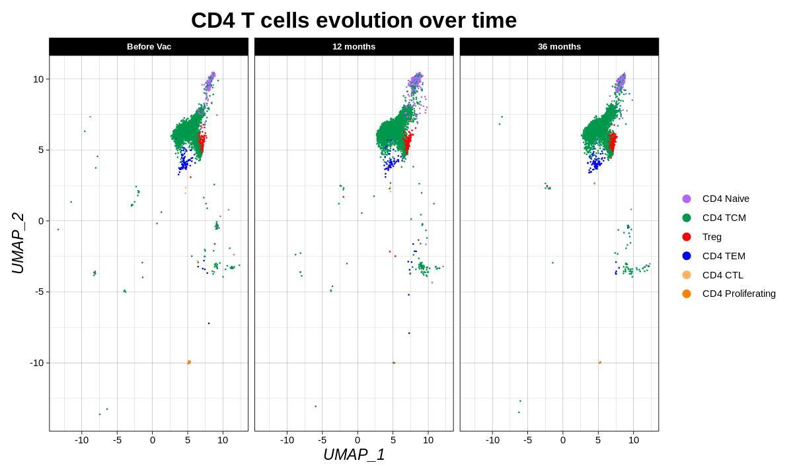
    


```R
options(repr.plot.width=12, repr.plot.height=8)

#CD4_cells.colors <- c("#FF66FF", "#B266FF", "#FF0000", "#0000FF", "#FFCCE5", "#CCCC00")

BARPLOT_CLUSTER_DISTRIBUTION_BY_SAMPLE <- ggplot(CD4_cells@meta.data) +
  aes(x = Sample, fill = predicted.celltype.l2) +
  geom_bar(position = "fill") +
  #scale_fill_viridis_d(option = "viridis", direction = 1) +
  scale_fill_manual(values = CD4_cells.colors) +
  labs(
    x = "Samples",
    y = "Relative Proportion",
    title = "CD4 T Cell distribution over time",
    fill = "Cells"
  ) +
  theme_linedraw() +
  theme(
    legend.position = "right",
    plot.title = element_text(size = 20L,
    face = "bold",
    hjust = 0.5),
    axis.title.y = element_text(size = 14L,
    face = "italic"),
    axis.title.x = element_text(size = 14L,
    face = "italic"),
    strip.text.x = element_text(size = 8,
    face = "bold"),
  ) +
  facet_grid(. ~ Sample, scales = 'free_x', space = 'free') 
BARPLOT_CLUSTER_DISTRIBUTION_BY_SAMPLE

ggsave(paste0(outdir, "RESULTS/PLOTS/BARPLOT/", "Differentiated_CD4_T_CEll_DISTRIBUTION_BY_SAMPLE.png"), 
       plot = BARPLOT_CLUSTER_DISTRIBUTION_BY_SAMPLE, scale = 1, width = 20, height = 15, units = 'cm', dpi = 300)
```


    

    


### Does the distribution of CD4 cells have significant difference over time ?


```R
# Does the distribution of CD4 cells have significant difference over time

CD4_cells_for_stats <- tibble(CD4_cells$Sample, CD4_cells$predicted.celltype.l2.score, 
                              CD4_cells$predicted.celltype.l2) 
colnames(CD4_cells_for_stats) <- c("Sample", "predicted.celltype.l2.score", "predicted.celltype.l2")

#CD4_cells_for_stats$Sample <- factor(CD4_cells_for_stats$Sample, levels = unique(CD4_cells_for_stats$Sample))
dim(CD4_cells_for_stats)
head(CD4_cells_for_stats)
```


<style>
.list-inline {list-style: none; margin:0; padding: 0}
.list-inline>li {display: inline-block}
.list-inline>li:not(:last-child)::after {content: "\00b7"; padding: 0 .5ex}
</style>
<ol class=list-inline><li>15000</li><li>3</li></ol>


<table class="dataframe">
<caption>A tibble: 6 × 3</caption>
<thead>
	<tr><th scope=col>Sample</th><th scope=col>predicted.celltype.l2.score</th><th scope=col>predicted.celltype.l2</th></tr>
	<tr><th scope=col>&lt;fct&gt;</th><th scope=col>&lt;dbl&gt;</th><th scope=col>&lt;chr&gt;</th></tr>
</thead>
<tbody>
	<tr><td>Before Vac</td><td>0.4672674</td><td>CD4 Naive</td></tr>
	<tr><td>Before Vac</td><td>0.8388648</td><td>CD4 TCM  </td></tr>
	<tr><td>Before Vac</td><td>0.9606646</td><td>CD4 TCM  </td></tr>
	<tr><td>Before Vac</td><td>0.6875841</td><td>CD4 TCM  </td></tr>
	<tr><td>Before Vac</td><td>0.9822624</td><td>CD4 TCM  </td></tr>
	<tr><td>Before Vac</td><td>0.9715183</td><td>CD4 TCM  </td></tr>
</tbody>
</table>


```R
t1 <- tail(CD4_cells_for_stats, 5000)
```


```R
shapiro.test(CD4_cells_for_stats$predicted.celltype.l2.score[1:5000])
shapiro.test(t1$predicted.celltype.l2.score)
```


    
    	Shapiro-Wilk normality test
    
    data:  CD4_cells_for_stats$predicted.celltype.l2.score[1:5000]
    W = 0.88107, p-value < 2.2e-16


    
    	Shapiro-Wilk normality test
    
    data:  t1$predicted.celltype.l2.score
    W = 0.87938, p-value < 2.2e-16


```R
# From the output, the p-value < 0.05 implying that the distribution of the data significantly different
# from normal distribution. In other words, we can not assume the normality.
```


```R
# Check Normality distribution

#ggqqplot(CD4_cells_for_stats$predicted.celltype.l2.score) + ggdensity(CD4_cells_for_stats$predicted.celltype.l2.score) 
```


```R
options(repr.plot.width=12, repr.plot.height=8) # Gère la taille des figures dans le notebook
# combine plot and statistical test with ggbarstats
#library(ggstatsplot) 
p_bar <- ggbarstats(
  CD4_cells_for_stats, predicted.celltype.l2, Sample, 
  label.args = list(alpha = 1, fill = "white", size = 7),
  #proportion.test = results.subtitle,
  results.subtitle = TRUE,
  type = "nonparametric",
  paired = TRUE,
  bf.message = FALSE,
  sampling.plan = "hypergeom",
  subtitle = paste0(
    "Chi-square test", ", p-value = ",
    1
  )
) + 
    #scale_fill_manual(values = c(HD = "gray", RC = "gold3", PD2 = "aquamarine4", PD1 = "darkorange1")) +
    theme(
    legend.position = "right",
    legend.title = element_text(size=14L, face = "bold"), #change legend title font size
    legend.text = element_text(size=12L, face = "bold"), #change legend text font size
    plot.title = element_text(size = 14L,face = "bold", hjust = 0.5),
    plot.subtitle = element_text(size = 12L,face = "bold"),
    axis.title.y = element_text(size = 14L,face = "bold"),
    axis.title.x = element_text(size = 0),
    axis.text.x = element_text(size = 12L,face = "bold", angle = 15),
    axis.text.y = element_text(size = 12L,face = "bold"),
    strip.text = element_text(size = 10, face = "bold")
   ) #+
    #coord_flip()
p_bar
```


    

    


### Normalize and scale  CD4 T Cell before reclustering


```R
CD4_cells %>% NormalizeData() %>%
    FindVariableFeatures() %>%
    ScaleData() %>%
    RunPCA() -> CD4_cells
```

    Centering and scaling data matrix
    
    PC_ 1 
    Positive:  ARHGAP15, DPYD, RABGAP1L, UTRN, RORA, SKAP1, PAG1, EML4, KLF12, RASA3 
    	   CHST11, SOS1, ATXN1, CASK, PPP1R16B, LINC01619, MBNL1, SLCO3A1, P2RY8, PHACTR2 
    	   NIBAN1, LPP, DOCK10, NEAT1, AKT3, MAP3K1, INPP4B, SIK3, ZBTB20, MAP3K5 
    Negative:  RPL10, RPS18, RPS12, RPLP1, FTL, LTB, ACTG1, ACTB, JUNB, GAPDH 
    	   TRBC1, VIM, HIST1H4C, AIF1, LRRN3, STMN1, GTSCR1, H2AFZ, DUT, HIST1H3D 
    	   TUBA1B, AK5, HECW2, TUBB, IGF1R, LINC01891, ISG15, EPHB6, AC096719.1, SLC40A1 
    PC_ 2 
    Positive:  FHIT, IGF1R, BACH2, TXK, LEF1, MAML2, PRKCA, MLLT3, FOXP1, CERS6 
    	   PCSK5, APBA2, PDE3B, PITPNC1, MBNL1, TGFBR2, NELL2, FAM13A, BCL2, ATP10A 
    	   SFMBT2, LEF1-AS1, SATB1-AS1, AK5, SERINC5, EDA, DOCK10, ANK3, ZBTB20, TSHZ2 
    Negative:  S100A4, S100A10, LGALS1, LINC02694, ITGB1, NIBAN1, CRIP1, ANXA2, AC013652.1, CYTOR 
    	   LGALS3, VIM, GAPDH, HLA-DRB1, ACTB, LMNA, MYO1F, SRGN, PPP1R16B, SAMSN1 
    	   KLF6, ACTG1, SAT1, C12orf75, HLA-DPB1, TOX, HLA-DQB1, IKZF2, TGFBR3, COTL1 
    PC_ 3 
    Positive:  IL7R, ANXA1, FRY, ANK3, LTB, VIM, RPS12, SOS1, TNFAIP3, RPS18 
    	   RPL10, UST, S100A4, RPLP1, ADAM23, RBMS1, ADAM19, CRIP1, ERN1, MYBL1 
    	   FOS, AKT3, PDE4D, GAB2, GREM2, ARHGAP15, CDC14A, USP46, STAT4, TAFA1 
    Negative:  IKZF2, TOX, AC093865.1, CTLA4, TTN, STAM, CCDC141, FOXP3, LINC02694, BCAS1 
    	   RTKN2, MIR181A1HG, ENTPD1, LDLRAD4, HLA-DRB1, FANK1, MIR4435-2HG, GBP5, ST8SIA6, F5 
    	   SLC12A6, VAV3, HLA-DQA1, TIGIT, CDHR3, MARCH3, AC013652.1, PTPRJ, PALM2-AKAP2, TSHR 
    PC_ 4 
    Positive:  LYN, SLC8A1, FAM49A, LRMDA, PLXDC2, ZEB2, SYK, DOCK5, MEF2C, MCTP1 
    	   ADGRE2, IRAK3, HCK, RAB31, MARCH1, WDFY3, CD86, CLEC12A, GRK3, TCF7L2 
    	   KYNU, PID1, SPI1, RBM47, FCGR3A, DAPK1, IFI30, CSF2RA, SLC11A1, ITGAX 
    Negative:  SKAP1, LINC02694, IKZF2, TOX, STAM, AC093865.1, CASK, AC013652.1, AL136456.1, ARHGAP15 
    	   CTLA4, RORA, TTN, RASA3, PLCL1, ATXN1, DUSP16, PPP1R16B, KLF12, GLCCI1 
    	   RTKN2, PAM, CCDC141, CEP128, SGMS1, PYHIN1, F5, IL2RA, INPP4B, LDLRAD4 
    PC_ 5 
    Positive:  SLC8A1, LRMDA, IRAK3, HCK, SYK, LYN, PLXDC2, ADGRE2, MTSS1, FAM49A 
    	   MARCH1, GRK3, TCF7L2, MCTP1, WDFY3, PIK3AP1, DOCK5, ZEB2, SLC11A1, PAPSS2 
    	   LRRK2, CD86, MS4A7, NAMPT, SERPINA1, CTBP2, IFI30, UST, ITGAX, FMNL2 
    Negative:  GP1BB, PPBP, NRGN, PF4, GNG11, TUBB1, CAVIN2, MYL9, GP9, TREML1 
    	   CLU, PRKAR2B, SPARC, ITGA2B, CMTM5, F13A1, ACRBP, MPIG6B, CD9, RGS18 
    	   PTCRA, CCL5, AP001189.1, TMEM40, AC147651.1, HIST1H2AC, CLEC1B, SNCA, THBS1, PLEK 
    


### Pre-clustering of CD4 T Cells subset


```R
elbowplot <- ElbowPlot(CD4_cells) +  geom_hline(yintercept=2.5, col = "red")
elbowplot
```


    
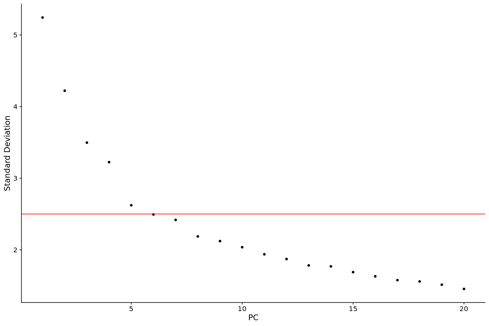
    


```R
# Find clusters

CD4_cells <- FindNeighbors(CD4_cells, dims = 1:7) %>%
    FindClusters(resolution = c(0.3,0.4,0.5,0.6,0.8)) %>%
    RunUMAP(dims = 1:7)
    
```

    Computing nearest neighbor graph
    
    Computing SNN
    


    Modularity Optimizer version 1.3.0 by Ludo Waltman and Nees Jan van Eck
    
    Number of nodes: 15000
    Number of edges: 444059
    
    Running Louvain algorithm...
    Maximum modularity in 10 random starts: 0.8742
    Number of communities: 8
    Elapsed time: 1 seconds
    Modularity Optimizer version 1.3.0 by Ludo Waltman and Nees Jan van Eck
    
    Number of nodes: 15000
    Number of edges: 444059
    
    Running Louvain algorithm...
    Maximum modularity in 10 random starts: 0.8572
    Number of communities: 9
    Elapsed time: 1 seconds
    Modularity Optimizer version 1.3.0 by Ludo Waltman and Nees Jan van Eck
    
    Number of nodes: 15000
    Number of edges: 444059
    
    Running Louvain algorithm...
    Maximum modularity in 10 random starts: 0.8431
    Number of communities: 11
    Elapsed time: 1 seconds
    Modularity Optimizer version 1.3.0 by Ludo Waltman and Nees Jan van Eck
    
    Number of nodes: 15000
    Number of edges: 444059
    
    Running Louvain algorithm...
    Maximum modularity in 10 random starts: 0.8314
    Number of communities: 13
    Elapsed time: 1 seconds
    Modularity Optimizer version 1.3.0 by Ludo Waltman and Nees Jan van Eck
    
    Number of nodes: 15000
    Number of edges: 444059
    
    Running Louvain algorithm...
    Maximum modularity in 10 random starts: 0.8126
    Number of communities: 16
    Elapsed time: 1 seconds


    Warning message:
    “The default method for RunUMAP has changed from calling Python UMAP via reticulate to the R-native UWOT using the cosine metric
    To use Python UMAP via reticulate, set umap.method to 'umap-learn' and metric to 'correlation'
    This message will be shown once per session”
    16:01:07 UMAP embedding parameters a = 0.9922 b = 1.112
    
    16:01:07 Read 15000 rows and found 7 numeric columns
    
    16:01:07 Using Annoy for neighbor search, n_neighbors = 30
    
    16:01:07 Building Annoy index with metric = cosine, n_trees = 50
    
    0%   10   20   30   40   50   60   70   80   90   100%
    
    [----|----|----|----|----|----|----|----|----|----|
    
    *
    *
    *
    *
    *
    *
    *
    *
    *
    *
    *
    *
    *
    *
    *
    *
    *
    *
    *
    *
    *
    *
    *
    *
    *
    *
    *
    *
    *
    *
    *
    *
    *
    *
    *
    *
    *
    *
    *
    *
    *
    *
    *
    *
    *
    *
    *
    *
    *
    *
    |
    
    16:01:08 Writing NN index file to temp file /tmp/jobscratch/7165//RtmpeyTK9Q/file2e4a9f34b273e0
    
    16:01:08 Searching Annoy index using 1 thread, search_k = 3000
    
    16:01:13 Annoy recall = 100%
    
    16:01:13 Commencing smooth kNN distance calibration using 1 thread
     with target n_neighbors = 30
    
    16:01:14 Initializing from normalized Laplacian + noise (using irlba)
    
    16:01:15 Commencing optimization for 200 epochs, with 586358 positive edges
    
    16:01:20 Optimization finished
    


```R
head(CD4_cells)
```


<table class="dataframe">
<caption>A data.frame: 10 × 37</caption>
<thead>
	<tr><th></th><th scope=col>orig.ident</th><th scope=col>nCount_RNA</th><th scope=col>nFeature_RNA</th><th scope=col>seq_folder</th><th scope=col>nUMI</th><th scope=col>nGene</th><th scope=col>Sample</th><th scope=col>TISSUE</th><th scope=col>ID</th><th scope=col>log10GenesPerUMI</th><th scope=col>⋯</th><th scope=col>predicted.celltype.l2.score</th><th scope=col>predicted.celltype.l2</th><th scope=col>predicted.celltype.l3.score</th><th scope=col>predicted.celltype.l3</th><th scope=col>mapping.score</th><th scope=col>RNA_snn_res.0.3</th><th scope=col>RNA_snn_res.0.4</th><th scope=col>RNA_snn_res.0.5</th><th scope=col>RNA_snn_res.0.6</th><th scope=col>RNA_snn_res.0.8</th></tr>
	<tr><th></th><th scope=col>&lt;chr&gt;</th><th scope=col>&lt;dbl&gt;</th><th scope=col>&lt;int&gt;</th><th scope=col>&lt;chr&gt;</th><th scope=col>&lt;dbl&gt;</th><th scope=col>&lt;int&gt;</th><th scope=col>&lt;fct&gt;</th><th scope=col>&lt;chr&gt;</th><th scope=col>&lt;chr&gt;</th><th scope=col>&lt;dbl&gt;</th><th scope=col>⋯</th><th scope=col>&lt;dbl&gt;</th><th scope=col>&lt;chr&gt;</th><th scope=col>&lt;dbl&gt;</th><th scope=col>&lt;chr&gt;</th><th scope=col>&lt;dbl&gt;</th><th scope=col>&lt;fct&gt;</th><th scope=col>&lt;fct&gt;</th><th scope=col>&lt;fct&gt;</th><th scope=col>&lt;fct&gt;</th><th scope=col>&lt;fct&gt;</th></tr>
</thead>
<tbody>
	<tr><th scope=row>BSL_AAACCCAAGAATTGTG-1</th><td>BSL</td><td>3004</td><td>1065</td><td>UCPVAX_P23</td><td>3004</td><td>1065</td><td>BSL</td><td>BASELINE</td><td>P23</td><td>0.8705034</td><td>⋯</td><td>0.4672674</td><td>CD4 Naive</td><td>0.4672674</td><td>CD4 Naive</td><td>0.9076546</td><td>1</td><td>2</td><td>7</td><td>8</td><td>9 </td></tr>
	<tr><th scope=row>BSL_AAACCCAAGATCACCT-1</th><td>BSL</td><td>3280</td><td>1582</td><td>UCPVAX_P23</td><td>3280</td><td>1582</td><td>BSL</td><td>BASELINE</td><td>P23</td><td>0.9099321</td><td>⋯</td><td>0.8388648</td><td>CD4 TCM  </td><td>0.6200846</td><td>CD4 TCM_3</td><td>0.5767091</td><td>3</td><td>3</td><td>4</td><td>2</td><td>0 </td></tr>
	<tr><th scope=row>BSL_AAACCCAAGCAACAGC-1</th><td>BSL</td><td>3122</td><td>1546</td><td>UCPVAX_P23</td><td>3123</td><td>1547</td><td>BSL</td><td>BASELINE</td><td>P23</td><td>0.9126984</td><td>⋯</td><td>0.9606646</td><td>CD4 TCM  </td><td>0.9209200</td><td>CD4 TCM_1</td><td>0.2722068</td><td>4</td><td>5</td><td>1</td><td>4</td><td>11</td></tr>
	<tr><th scope=row>BSL_AAACCCAAGGATCATA-1</th><td>BSL</td><td>4024</td><td>1911</td><td>UCPVAX_P23</td><td>4024</td><td>1911</td><td>BSL</td><td>BASELINE</td><td>P23</td><td>0.9102835</td><td>⋯</td><td>0.6875841</td><td>CD4 TCM  </td><td>0.5647722</td><td>CD4 TCM_2</td><td>0.4511575</td><td>0</td><td>0</td><td>6</td><td>3</td><td>2 </td></tr>
	<tr><th scope=row>BSL_AAACCCACATCGCTGG-1</th><td>BSL</td><td>3923</td><td>1714</td><td>UCPVAX_P23</td><td>3925</td><td>1715</td><td>BSL</td><td>BASELINE</td><td>P23</td><td>0.8999467</td><td>⋯</td><td>0.9822624</td><td>CD4 TCM  </td><td>0.6132103</td><td>CD4 TCM_3</td><td>0.5165912</td><td>3</td><td>3</td><td>4</td><td>2</td><td>0 </td></tr>
	<tr><th scope=row>BSL_AAACCCAGTTTCGGCG-1</th><td>BSL</td><td>4522</td><td>1796</td><td>UCPVAX_P23</td><td>4522</td><td>1796</td><td>BSL</td><td>BASELINE</td><td>P23</td><td>0.8902906</td><td>⋯</td><td>0.9715183</td><td>CD4 TCM  </td><td>0.9349861</td><td>CD4 TCM_3</td><td>0.8983350</td><td>3</td><td>3</td><td>4</td><td>2</td><td>0 </td></tr>
	<tr><th scope=row>BSL_AAACCCATCTTTCCGG-1</th><td>BSL</td><td>2332</td><td>1161</td><td>UCPVAX_P23</td><td>2332</td><td>1161</td><td>BSL</td><td>BASELINE</td><td>P23</td><td>0.9100592</td><td>⋯</td><td>0.9544789</td><td>CD4 TCM  </td><td>0.9021856</td><td>CD4 TCM_1</td><td>0.4925671</td><td>2</td><td>1</td><td>3</td><td>0</td><td>6 </td></tr>
	<tr><th scope=row>BSL_AAACGAAAGGGTGAAA-1</th><td>BSL</td><td>1241</td><td> 766</td><td>UCPVAX_P23</td><td>1242</td><td> 767</td><td>BSL</td><td>BASELINE</td><td>P23</td><td>0.9323471</td><td>⋯</td><td>0.5600328</td><td>CD4 TCM  </td><td>0.4962507</td><td>CD4 TCM_1</td><td>0.2262777</td><td>4</td><td>5</td><td>1</td><td>4</td><td>11</td></tr>
	<tr><th scope=row>BSL_AAACGAACAACGGCTC-1</th><td>BSL</td><td>5804</td><td>2200</td><td>UCPVAX_P23</td><td>5804</td><td>2200</td><td>BSL</td><td>BASELINE</td><td>P23</td><td>0.8880618</td><td>⋯</td><td>0.9782456</td><td>CD4 TCM  </td><td>0.7265855</td><td>CD4 TCM_3</td><td>0.6868615</td><td>0</td><td>0</td><td>3</td><td>0</td><td>4 </td></tr>
	<tr><th scope=row>BSL_AAACGAATCGTGGGTC-1</th><td>BSL</td><td>9936</td><td>3449</td><td>UCPVAX_P23</td><td>9936</td><td>3449</td><td>BSL</td><td>BASELINE</td><td>P23</td><td>0.8850403</td><td>⋯</td><td>0.8185557</td><td>CD4 TCM  </td><td>0.4298799</td><td>CD4 TCM_1</td><td>0.4106024</td><td>3</td><td>3</td><td>4</td><td>2</td><td>0 </td></tr>
</tbody>
</table>


```R
#saveRDS(CD4_cells, "/Work/Users/bndao/UCPVAX_scRNA/WITHOUT_V4/CD4_T_CELLS/RESULTS/TABLES/CD4_cells.rds")
saveRDS(CD4_cells, "/Work/Users/bndao/UCPVAX_scRNA/WITHOUT_V4/CD4_T_CELLS/RESULTS/TABLES/CD4_cells.rds")
```


```R
CD4_cells <- readRDS("/Work/Users/bndao/UCPVAX_scRNA/WITHOUT_V4/CD4_T_CELLS/RESULTS/TABLES/CD4_cells.rds")
```


```R
unique(CD4_cells$RNA_snn_res.0.3)
```


<style>
.list-inline {list-style: none; margin:0; padding: 0}
.list-inline>li {display: inline-block}
.list-inline>li:not(:last-child)::after {content: "\00b7"; padding: 0 .5ex}
</style>
<ol class=list-inline><li>1</li><li>3</li><li>4</li><li>0</li><li>2</li><li>5</li><li>7</li><li>6</li></ol>

<details>
	<summary style=display:list-item;cursor:pointer>
		<strong>Levels</strong>:
	</summary>
	<style>
	.list-inline {list-style: none; margin:0; padding: 0}
	.list-inline>li {display: inline-block}
	.list-inline>li:not(:last-child)::after {content: "\00b7"; padding: 0 .5ex}
	</style>
	<ol class=list-inline><li>'0'</li><li>'1'</li><li>'2'</li><li>'3'</li><li>'4'</li><li>'5'</li><li>'6'</li><li>'7'</li></ol>
</details>


```R
cluster.color <- c("#FF66FF", "#B266FF", "#CCCC00", "#0000FF", "#FFCCE5", "#FF0000", "#FF8000", "#00CC66")
#sample.color <- c("#0000FF", "#009999", "#FF3399")

p <- DimPlot(CD4_cells, group.by = "RNA_snn_res.0.3", label = TRUE, label.size = 9, pt.size = 0.5, cols = cluster.color) + 
    NoLegend() +
    ggtitle("CD4 T Cells unsupervised clustering, resolution = 0.3") +
    theme(
    legend.position = "right",
    plot.title = element_text(size = 14L,
    face = "bold",
    hjust = 0.5),
    axis.title.y = element_text(size = 12L,
    face = "italic"),
    axis.title.x = element_text(size = 12L,
    face = "italic"),
    strip.text.x = element_text(size = 8,
    face = "bold")
  )
#p
#ggsave("/Work/Users/bndao/UCPVAX_scRNA/WITHOUT_V4/CD4_T_CELLS/RESULTS/PLOTS/UMAP/CD4_cells.clusters.png", plot = p, device = 'png', path = NULL,
       #scale = 1, width = 15, height = 10, units = 'cm', dpi = 600)
```


```R
table(CD4_cells$RNA_snn_res.0.3)
```


    
       0    1    2    3    4    5    6    7 
    3659 2965 2878 2260 1532 1261  298  147 


```R
p <- DimPlot(CD4_cells, group.by = "RNA_snn_res.0.3", label = TRUE, label.size = 9, pt.size = 0.5, cols = cluster.color, 
    split.by ="Sample") + NoLegend() +
    ggtitle("CD4 T Cells unsupervised clustering, resolution = 0.3") +
    theme(
    legend.position = "right",
    plot.title = element_text(size = 14L,
    face = "bold",
    hjust = 0.5),
    axis.title.y = element_text(size = 12L,
    face = "italic"),
    axis.title.x = element_text(size = 12L,
    face = "italic"),
    strip.text.x = element_text(size = 8,
    face = "bold")
  )
p

ggsave("/Work/Users/bndao/UCPVAX_scRNA/WITHOUT_V4/CD4_T_CELLS/RESULTS/PLOTS/UMAP/CD4_cells_per_sample.clusters.png", plot = p, device = 'png', path = NULL,
       scale = 1, width = 20, height = 12, units = 'cm', dpi = 600)
```


    

    


### Cell Assignation based on canonical markers' expression


```R
Idents(CD4_cells) <- "RNA_snn_res.0.3"

p1 <- VlnPlot(CD4_cells, features = c("TBX21", "IL2", "LTBR", "IFNG", "GATA3", "RORC", "BCL6", "FOXP3", "NKG7"), 
              split.by = "Sample", pt.size = 0) + NoLegend()
p1

p2 <- VlnPlot(CD4_cells, features = c("TBX21", "IL2", "LTBR", "IFNG", "GATA3", "RORC", "BCL6", "FOXP3"), 
              group.by = "Sample", pt.size = 0) + NoLegend()
p2
```

    The default behaviour of split.by has changed.
    Separate violin plots are now plotted side-by-side.
    To restore the old behaviour of a single split violin,
    set split.plot = TRUE.
          
    This message will be shown once per session.
    


    

    


    
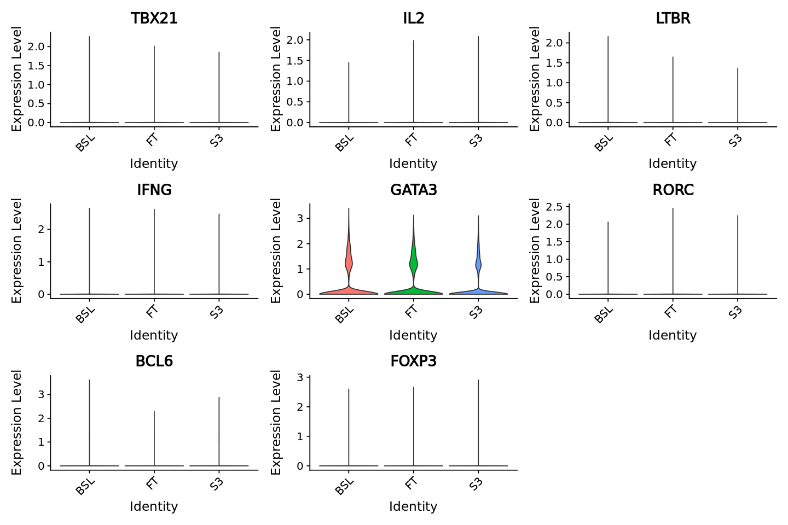
    


```R
Tnaive <- VlnPlot(CD4_cells, features = c("CCR7", "SELL", "TCF7", "CD4"), split.by = "Sample", pt.size = 0) 
Tnaive
```


    

    


```R
Th17 <- VlnPlot(CD4_cells, features = c("RORC", "IL17RA", "IL21", "IL26", "BATF"), split.by = "Sample", pt.size = 0)
Th17
```


    

    


```R
CTL <- VlnPlot(CD4_cells, features = c("NKG7", "CCL5", "CRTAM", "PRF1"), split.by = "Sample", pt.size = 0) + NoLegend()
CTL
```


    
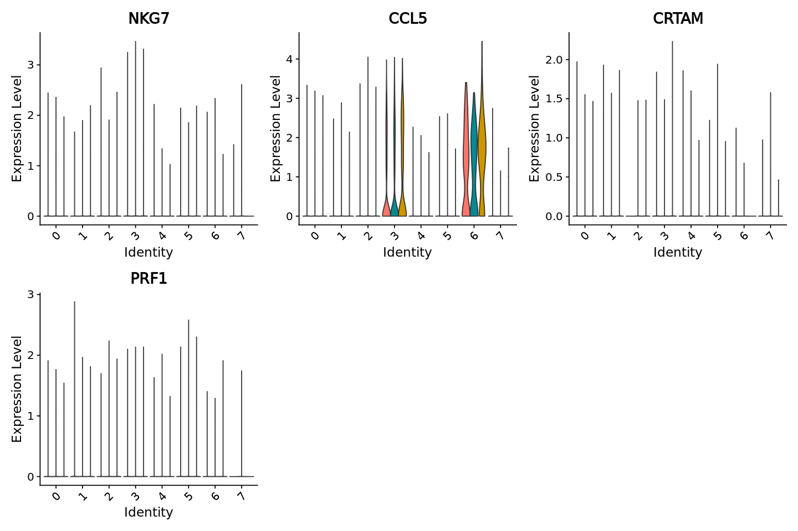
    


```R
Tproliferative <- VlnPlot(CD4_cells, features = c("MKI67"), split.by = "Sample", pt.size = 0)
Tproliferative
```


    

    


```R
Treg <- VlnPlot(CD4_cells, features = c("FOXP3", "RTKN2", "IL2RA", "HPGD"), split.by = "Sample", pt.size = 0)
Treg
```


    
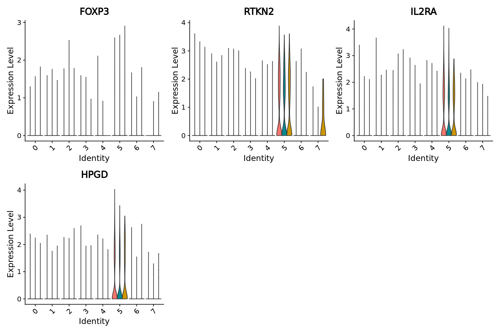
    


```R
Th2 <- VlnPlot(CD4_cells, features = c("GATA3", "IFNG-AS1", "IL4", "IL5", "IL13", "STAT3"), split.by = "Sample", pt.size = 0)
Th2
```


    

    


```R
Th22 <- VlnPlot(CD4_cells, features = c("IL22RA", "CCL7", "CCL15", "AHR"), split.by = "Sample", pt.size = 0) 
Th22
```

    Warning message in FetchData.Seurat(object = object, vars = features, slot = slot):
    “The following requested variables were not found: IL22RA, CCL7, CCL15”


    

    


```R
Th9 <- VlnPlot(CD4_cells, features = c("IL9R"), , split.by = "Sample", pt.size = 0) 
Th9
```


    
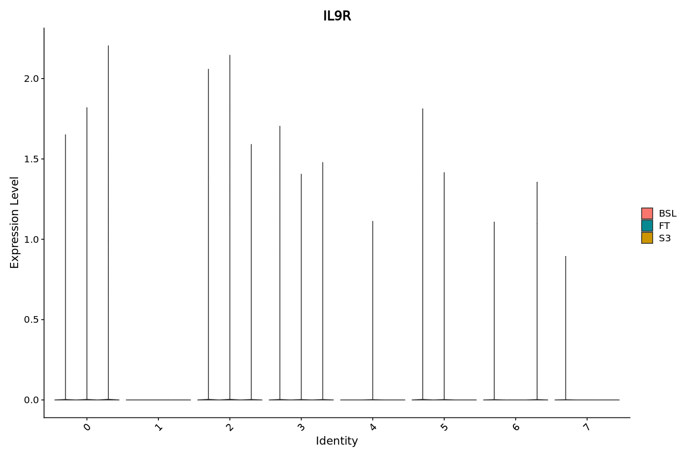
    


```R
Tex <- VlnPlot(CD4_cells, features = c("CD3D", "CD3E", "LAG3", "PDCD1", "TIGIT"), split.by = "Sample", pt.size = 0) 
Tex
```


    

    


### Find cluster markers


```R
# Cluster's markers

Idents(CD4_cells) <- "RNA_snn_res.0.3"
CD4_cells.markers_before_annotation <- FindAllMarkers(CD4_cells, only.pos = TRUE, min.pct = 0.25, logfc.threshold = 0.25)
CD4_cells.markers_before_annotation %>%
    group_by(cluster) %>%
    top_n(n = 5, wt = avg_log2FC) -> CD4_cells.top5_before_annotation


#write.table(x = CD4_cells.markers_before_annotation, file = paste0(outdir, "AZIMUTH/", "CD4 T Cells/", "CD4_cells.markers_before_annotation.tsv"), 
            #quote = F, col.names = T, row.names = F, sep = "\t")
```

    Calculating cluster 0
    
    Calculating cluster 1
    
    Calculating cluster 2
    
    Calculating cluster 3
    
    Calculating cluster 4
    
    Calculating cluster 5
    
    Calculating cluster 6
    
    Calculating cluster 7
    


```R
dir.create("/Work/Users/bndao/UCPVAX_scRNA/WITHOUT_V4/CD4_T_CELLS/RESULTS/PLOTS/HEATMAP/", recursive = T)
```

    Warning message in dir.create("/Work/Users/bndao/UCPVAX_scRNA/WITHOUT_V4/CD4_T_CELLS/RESULTS/PLOTS/HEATMAP/", :
    “'/Work/Users/bndao/UCPVAX_scRNA/WITHOUT_V4/CD4_T_CELLS/RESULTS/PLOTS/HEATMAP' already exists”


```R
# Save Heatmap with resolution = 0.3

options(repr.plot.width=15, repr.plot.height=8)
DefaultAssay(CD4_cells) <- "RNA"

CD4_cells.signatures <- DoHeatmap(CD4_cells, features = CD4_cells.top5_before_annotation$gene, group.by = "RNA_snn_res.0.3") +
    ggtitle("Resolution Equal to 0.3") +
    theme(plot.title = element_text(size = 16, face = "bold", hjust = 0.5))

#CD4_cells.signatures

ggsave(paste0("/Work/Users/bndao/UCPVAX_scRNA/WITHOUT_V4/CD4_T_CELLS/RESULTS/PLOTS/HEATMAP/", "CD4_cells.signatures.png"), plot = CD4_cells.signatures, device = 'png', path = NULL,
       scale = 1, width = 35, height = 25, units = 'cm', dpi = 600)
```

### Set cluster names by Cell names


```R
Idents(CD4_cells) <- "RNA_snn_res.0.3" 
CD4_cells[["CD4_cells_clusters"]] <- Idents(object = CD4_cells)
CD4_cells <- StashIdent(object = CD4_cells, save.name = "RNA_snn_res.0.3")
Idents(CD4_cells) <- "CD4_cells_clusters"
```

    Warning message:
    “`StashIdent()` was deprecated in SeuratObject 3.0.0.
    ℹ Please use CD4_cells[["RNA_snn_res.0.3"]] <- Idents(CD4_cells)”


```R
# List of current cluster IDs
current_cluster_ids <- c(0, 1, 2, 3, 4, 5, 6,7)

# List of new cluster IDs
new_cluster_ids <- c("Th2", "Tnaive", "Th1", "Th1", "Tnaive", "Treg", "Th1", "Tfh")

# Changing IDs to cell type
CD4_cells@active.ident <- plyr::mapvalues(x = CD4_cells@active.ident, 
                                from = current_cluster_ids, 
                                to = new_cluster_ids)

```


```R
CD4_cells@meta.data$Sample <- str_replace(CD4_cells@meta.data$Sample, "BSL", "Before Vac")
CD4_cells@meta.data$Sample <- str_replace(CD4_cells@meta.data$Sample, "FT", "12 months")
CD4_cells@meta.data$Sample <- str_replace(CD4_cells@meta.data$Sample, "S3", "36 months")
CD4_cells@meta.data$Sample <- factor(CD4_cells@meta.data$Sample, levels = unique(CD4_cells@meta.data$Sample))
```


```R
levels(CD4_cells)

# Assign color to new cell types
#cell.color <- c("#0000FF", "#00994C", "#FF00FF", "#FF0000", "#FF8000")
#cell.color <- c("cornflowerblue", "lightgreen", "darkorange", "violet", "#FF00FF")
cell.color <- c("cornflowerblue", "gray", "#FF00FF", "darkorange", "darkgreen")
#cell.color <- c("cornflowerblue", "gray", "darkorange", "lightgreen", "#FF00FF")
sample.color <- c("#0000FF", "#009999", "#FF3399")
states_all <- levels(CD4_cells)
names(cell.color) <- states_all
```


<style>
.list-inline {list-style: none; margin:0; padding: 0}
.list-inline>li {display: inline-block}
.list-inline>li:not(:last-child)::after {content: "\00b7"; padding: 0 .5ex}
</style>
<ol class=list-inline><li>'Th2'</li><li>'Tnaive'</li><li>'Th1'</li><li>'Treg'</li><li>'Tfh'</li></ol>


```R
levels(CD4_cells$CD4_cells_clusters)
```


<style>
.list-inline {list-style: none; margin:0; padding: 0}
.list-inline>li {display: inline-block}
.list-inline>li:not(:last-child)::after {content: "\00b7"; padding: 0 .5ex}
</style>
<ol class=list-inline><li>'0'</li><li>'1'</li><li>'2'</li><li>'3'</li><li>'4'</li><li>'5'</li><li>'6'</li><li>'7'</li></ol>


```R
# Add new cell types column to meatadat
polarized_cells <- CD4_cells
polarized_cells@meta.data <- polarized_cells@meta.data |>
    mutate(CellType = case_when(CD4_cells_clusters == "0" ~ "Th2",
                                CD4_cells_clusters == "1" ~ "Tnaive",
                                CD4_cells_clusters == "2" ~ "Th1",
                                CD4_cells_clusters == "3" ~ "Th1",
                                CD4_cells_clusters == "4" ~ "Tnaive",
                                CD4_cells_clusters == "5" ~ "Treg",
                                CD4_cells_clusters == "6" ~ "Th1",
                                CD4_cells_clusters == "7" ~ "Tfh")
           ) 
polarized_cells@meta.data$CellType <- factor(polarized_cells@meta.data$CellType, levels = c("Tnaive", "Th1", "Th2", "Treg", "Tfh"))
head(polarized_cells)
```


<table class="dataframe">
<caption>A data.frame: 10 × 39</caption>
<thead>
	<tr><th></th><th scope=col>orig.ident</th><th scope=col>nCount_RNA</th><th scope=col>nFeature_RNA</th><th scope=col>seq_folder</th><th scope=col>nUMI</th><th scope=col>nGene</th><th scope=col>Sample</th><th scope=col>TISSUE</th><th scope=col>ID</th><th scope=col>log10GenesPerUMI</th><th scope=col>⋯</th><th scope=col>predicted.celltype.l3.score</th><th scope=col>predicted.celltype.l3</th><th scope=col>mapping.score</th><th scope=col>RNA_snn_res.0.3</th><th scope=col>RNA_snn_res.0.4</th><th scope=col>RNA_snn_res.0.5</th><th scope=col>RNA_snn_res.0.6</th><th scope=col>RNA_snn_res.0.8</th><th scope=col>CD4_cells_clusters</th><th scope=col>CellType</th></tr>
	<tr><th></th><th scope=col>&lt;chr&gt;</th><th scope=col>&lt;dbl&gt;</th><th scope=col>&lt;int&gt;</th><th scope=col>&lt;chr&gt;</th><th scope=col>&lt;dbl&gt;</th><th scope=col>&lt;int&gt;</th><th scope=col>&lt;fct&gt;</th><th scope=col>&lt;chr&gt;</th><th scope=col>&lt;chr&gt;</th><th scope=col>&lt;dbl&gt;</th><th scope=col>⋯</th><th scope=col>&lt;dbl&gt;</th><th scope=col>&lt;chr&gt;</th><th scope=col>&lt;dbl&gt;</th><th scope=col>&lt;fct&gt;</th><th scope=col>&lt;fct&gt;</th><th scope=col>&lt;fct&gt;</th><th scope=col>&lt;fct&gt;</th><th scope=col>&lt;fct&gt;</th><th scope=col>&lt;fct&gt;</th><th scope=col>&lt;fct&gt;</th></tr>
</thead>
<tbody>
	<tr><th scope=row>BSL_AAACCCAAGAATTGTG-1</th><td>BSL</td><td>3004</td><td>1065</td><td>UCPVAX_P23</td><td>3004</td><td>1065</td><td>Before Vac</td><td>BASELINE</td><td>P23</td><td>0.8705034</td><td>⋯</td><td>0.4672674</td><td>CD4 Naive</td><td>0.9076546</td><td>1</td><td>2</td><td>7</td><td>8</td><td>9 </td><td>1</td><td>Tnaive</td></tr>
	<tr><th scope=row>BSL_AAACCCAAGATCACCT-1</th><td>BSL</td><td>3280</td><td>1582</td><td>UCPVAX_P23</td><td>3280</td><td>1582</td><td>Before Vac</td><td>BASELINE</td><td>P23</td><td>0.9099321</td><td>⋯</td><td>0.6200846</td><td>CD4 TCM_3</td><td>0.5767091</td><td>3</td><td>3</td><td>4</td><td>2</td><td>0 </td><td>3</td><td>Th1   </td></tr>
	<tr><th scope=row>BSL_AAACCCAAGCAACAGC-1</th><td>BSL</td><td>3122</td><td>1546</td><td>UCPVAX_P23</td><td>3123</td><td>1547</td><td>Before Vac</td><td>BASELINE</td><td>P23</td><td>0.9126984</td><td>⋯</td><td>0.9209200</td><td>CD4 TCM_1</td><td>0.2722068</td><td>4</td><td>5</td><td>1</td><td>4</td><td>11</td><td>4</td><td>Tnaive</td></tr>
	<tr><th scope=row>BSL_AAACCCAAGGATCATA-1</th><td>BSL</td><td>4024</td><td>1911</td><td>UCPVAX_P23</td><td>4024</td><td>1911</td><td>Before Vac</td><td>BASELINE</td><td>P23</td><td>0.9102835</td><td>⋯</td><td>0.5647722</td><td>CD4 TCM_2</td><td>0.4511575</td><td>0</td><td>0</td><td>6</td><td>3</td><td>2 </td><td>0</td><td>Th2   </td></tr>
	<tr><th scope=row>BSL_AAACCCACATCGCTGG-1</th><td>BSL</td><td>3923</td><td>1714</td><td>UCPVAX_P23</td><td>3925</td><td>1715</td><td>Before Vac</td><td>BASELINE</td><td>P23</td><td>0.8999467</td><td>⋯</td><td>0.6132103</td><td>CD4 TCM_3</td><td>0.5165912</td><td>3</td><td>3</td><td>4</td><td>2</td><td>0 </td><td>3</td><td>Th1   </td></tr>
	<tr><th scope=row>BSL_AAACCCAGTTTCGGCG-1</th><td>BSL</td><td>4522</td><td>1796</td><td>UCPVAX_P23</td><td>4522</td><td>1796</td><td>Before Vac</td><td>BASELINE</td><td>P23</td><td>0.8902906</td><td>⋯</td><td>0.9349861</td><td>CD4 TCM_3</td><td>0.8983350</td><td>3</td><td>3</td><td>4</td><td>2</td><td>0 </td><td>3</td><td>Th1   </td></tr>
	<tr><th scope=row>BSL_AAACCCATCTTTCCGG-1</th><td>BSL</td><td>2332</td><td>1161</td><td>UCPVAX_P23</td><td>2332</td><td>1161</td><td>Before Vac</td><td>BASELINE</td><td>P23</td><td>0.9100592</td><td>⋯</td><td>0.9021856</td><td>CD4 TCM_1</td><td>0.4925671</td><td>2</td><td>1</td><td>3</td><td>0</td><td>6 </td><td>2</td><td>Th1   </td></tr>
	<tr><th scope=row>BSL_AAACGAAAGGGTGAAA-1</th><td>BSL</td><td>1241</td><td> 766</td><td>UCPVAX_P23</td><td>1242</td><td> 767</td><td>Before Vac</td><td>BASELINE</td><td>P23</td><td>0.9323471</td><td>⋯</td><td>0.4962507</td><td>CD4 TCM_1</td><td>0.2262777</td><td>4</td><td>5</td><td>1</td><td>4</td><td>11</td><td>4</td><td>Tnaive</td></tr>
	<tr><th scope=row>BSL_AAACGAACAACGGCTC-1</th><td>BSL</td><td>5804</td><td>2200</td><td>UCPVAX_P23</td><td>5804</td><td>2200</td><td>Before Vac</td><td>BASELINE</td><td>P23</td><td>0.8880618</td><td>⋯</td><td>0.7265855</td><td>CD4 TCM_3</td><td>0.6868615</td><td>0</td><td>0</td><td>3</td><td>0</td><td>4 </td><td>0</td><td>Th2   </td></tr>
	<tr><th scope=row>BSL_AAACGAATCGTGGGTC-1</th><td>BSL</td><td>9936</td><td>3449</td><td>UCPVAX_P23</td><td>9936</td><td>3449</td><td>Before Vac</td><td>BASELINE</td><td>P23</td><td>0.8850403</td><td>⋯</td><td>0.4298799</td><td>CD4 TCM_1</td><td>0.4106024</td><td>3</td><td>3</td><td>4</td><td>2</td><td>0 </td><td>3</td><td>Th1   </td></tr>
</tbody>
</table>


```R
levels(polarized_cells@meta.data$CellType)
```


<style>
.list-inline {list-style: none; margin:0; padding: 0}
.list-inline>li {display: inline-block}
.list-inline>li:not(:last-child)::after {content: "\00b7"; padding: 0 .5ex}
</style>
<ol class=list-inline><li>'Tnaive'</li><li>'Th1'</li><li>'Th2'</li><li>'Treg'</li><li>'Tfh'</li></ol>


```R
saveRDS(polarized_cells, "/Work/Users/bndao/UCPVAX_scRNA/WITHOUT_V4/CD4_T_CELLS/RESULTS/TABLES/polarized_CD4_T_cells.rds")
```


```R
options(repr.plot.width=4, repr.plot.height=3)

CD4_cells.umap <- DimPlot(polarized_cells, reduction = "umap", group.by = "CellType", label = FALSE, pt.size = 0.1, cols = cell.color) + 
    ggtitle("Polarization of CD4 T Cells") + 
    theme(
      plot.title = element_text(size = 16, face = "bold", color = "#7ba39d", hjust = 0.5),
      axis.title.y = element_text(size = 10, face = "italic"),
      axis.title.x = element_text(size = 10, face = "italic"),
      axis.text = element_text(size = 6, face = "bold"),
      strip.text.x = element_text(size = 12, face = "bold", color = "#7ba39d"),
      axis.ticks.length = unit(.05, "cm"),
      legend.text = element_text(size = 8),
      panel.background = element_rect(fill = "white", colour = "grey50", linewidth = 1)    
    ) 
        
CD4_cells.umap

```


    
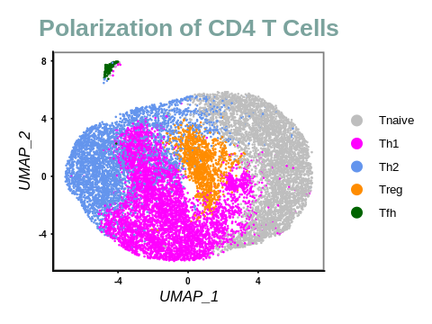
    


```R
options(repr.plot.width=6, repr.plot.height=2.5)
CD4_cells_per_sample.umap <- DimPlot(polarized_cells, reduction = "umap", , group.by = "CellType", split.by = "Sample", label = FALSE, pt.size = 0.1, cols = cell.color) +
    #ggtitle("CD4 T Cells Per Sample") + 
    theme(
      plot.title = element_text(size = 16, face = "bold", color = "#7ba39d", hjust = 0.5),
      axis.title.y = element_text(size = 10, face = "italic"),
      axis.title.x = element_text(size = 10, face = "italic"),
      axis.text = element_text(size = 6, face = "bold"),
      strip.text.x = element_text(size = 12, face = "bold", color = "#7ba39d"),
      axis.ticks.length = unit(.05, "cm"),
      legend.text = element_text(size = 8),
      panel.background = element_rect(fill = "white", colour = "grey50", linewidth = 1),     
    ) 
CD4_cells_per_sample.umap
```


    
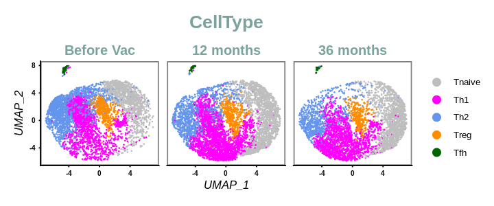
    


```R
# Save figures
jpeg(paste0(outdir, "RESULTS/PLOTS/UMAP/", "CD4_cells_umap_v6", ".png"), 
       width = 4, height = 3, units = 'in', res = 300)
CD4_cells.umap
dev.off()

jpeg(paste0(outdir, "RESULTS/PLOTS/UMAP/", "CD4_cells_per_sample_umap_v6", ".png"), 
        width = 6, height = 2.5, units = 'in', res = 300)
CD4_cells_per_sample.umap
dev.off()
```


<strong>png:</strong> 2


<strong>png:</strong> 2


```R
CellPerSample <- ddply(polarized_cells@meta.data,~Sample + CellType, nrow)

prop1=CellPerSample[CellPerSample$Sample == "Before Vac", ]$V1/sum(CellPerSample[CellPerSample$Sample == "Before Vac", ]$V1)
prop2=CellPerSample[CellPerSample$Sample == "12 months", ]$V1/sum(CellPerSample[CellPerSample$Sample == "12 months", ]$V1)
prop3=CellPerSample[CellPerSample$Sample == "36 months", ]$V1/sum(CellPerSample[CellPerSample$Sample == "36 months", ]$V1)

prop=c(prop1, prop2, prop3)
CellPerSample$Prop <- prop*100

dim(CellPerSample)
head(CellPerSample) 
tail(CellPerSample)
Cell.losed <- length(levels(CellPerSample$Sample))* length(levels(polarized_cells)) - nrow(CellPerSample)
paste0("There are", " ", Cell.losed, " ", "cell losed after reclustering")
```


<style>
.list-inline {list-style: none; margin:0; padding: 0}
.list-inline>li {display: inline-block}
.list-inline>li:not(:last-child)::after {content: "\00b7"; padding: 0 .5ex}
</style>
<ol class=list-inline><li>15</li><li>4</li></ol>


<table class="dataframe">
<caption>A data.frame: 6 × 4</caption>
<thead>
	<tr><th></th><th scope=col>Sample</th><th scope=col>CellType</th><th scope=col>V1</th><th scope=col>Prop</th></tr>
	<tr><th></th><th scope=col>&lt;fct&gt;</th><th scope=col>&lt;fct&gt;</th><th scope=col>&lt;int&gt;</th><th scope=col>&lt;dbl&gt;</th></tr>
</thead>
<tbody>
	<tr><th scope=row>1</th><td>Before Vac</td><td>Tnaive</td><td>1271</td><td>24.579385</td></tr>
	<tr><th scope=row>2</th><td>Before Vac</td><td>Th1   </td><td>1576</td><td>30.477664</td></tr>
	<tr><th scope=row>3</th><td>Before Vac</td><td>Th2   </td><td>1762</td><td>34.074647</td></tr>
	<tr><th scope=row>4</th><td>Before Vac</td><td>Treg  </td><td> 475</td><td> 9.185844</td></tr>
	<tr><th scope=row>5</th><td>Before Vac</td><td>Tfh   </td><td>  87</td><td> 1.682460</td></tr>
	<tr><th scope=row>6</th><td>12 months </td><td>Tnaive</td><td>1689</td><td>30.692350</td></tr>
</tbody>
</table>


<table class="dataframe">
<caption>A data.frame: 6 × 4</caption>
<thead>
	<tr><th></th><th scope=col>Sample</th><th scope=col>CellType</th><th scope=col>V1</th><th scope=col>Prop</th></tr>
	<tr><th></th><th scope=col>&lt;fct&gt;</th><th scope=col>&lt;fct&gt;</th><th scope=col>&lt;int&gt;</th><th scope=col>&lt;dbl&gt;</th></tr>
</thead>
<tbody>
	<tr><th scope=row>10</th><td>12 months</td><td>Tfh   </td><td>  39</td><td> 0.7087043</td></tr>
	<tr><th scope=row>11</th><td>36 months</td><td>Tnaive</td><td>1537</td><td>35.5293574</td></tr>
	<tr><th scope=row>12</th><td>36 months</td><td>Th1   </td><td>1649</td><td>38.1183541</td></tr>
	<tr><th scope=row>13</th><td>36 months</td><td>Th2   </td><td> 783</td><td>18.0998613</td></tr>
	<tr><th scope=row>14</th><td>36 months</td><td>Treg  </td><td> 336</td><td> 7.7669903</td></tr>
	<tr><th scope=row>15</th><td>36 months</td><td>Tfh   </td><td>  21</td><td> 0.4854369</td></tr>
</tbody>
</table>


'There are 0 cell losed after reclustering'


```R
options(repr.plot.width=8, repr.plot.height=6)

#red.bold.italic.text <- element_text(face = "bold.italic", color = "red")
bp_CellPerSample <- ggplot(data.frame(CellPerSample), aes(fill = CellType, y = Prop, x=Sample, label = round(Prop, digits = 1))) +
  geom_bar(stat="identity") + scale_fill_manual(values = cell.color) +
  geom_text(size = 2, position = position_stack(vjust = 0.5)) + 
   labs(x="", y="Proportion (%)", fill = "Cell type", title="Cellular evolution over time") +
  theme(
      legend.key.size = unit(1, 'cm'), #change legend key size
      legend.key.height = unit(1, 'cm'), #change legend key height
      legend.key.width = unit(1, 'cm'), #change legend key width
      legend.title = element_text(size=14), #change legend title font size
      legend.text = element_text(size=14), #change legend text font size
      plot.title = element_text(size = 16, face = "bold", color = "#7ba39d", hjust = 0.5),
      axis.title.y = element_text(size = 10, face = "italic"),
      axis.title.x = element_text(size = 10, face = "italic"),
      axis.text = element_text(size = 6, face = "bold"),
      strip.text.x = element_text(size = 12, face = "bold", color = "#7ba39d"),
      axis.ticks.length = unit(.05, "cm")    
    )  +
  theme_classic()
bp_CellPerSample


```


    
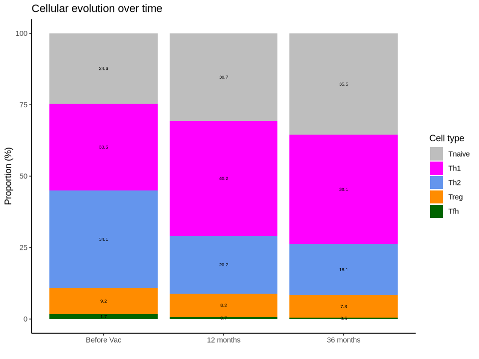
    


```R
ggsave(paste0(outdir,"RESULTS/PLOTS/BARPLOT/", "bp_CellPerSample", ".png"), plot = bp_CellPerSample, device = 'png', 
       path = NULL, scale = 1, width = 10, height = 8, units = 'cm', dpi = 600)
```

### # Differentially expressed markers 

##### Dotplot


```R
# Differentially expressed markers of CD4 memory
CD4_CD8_markers <- c("CD8A", "CD4")
memory_markers  <- c("CCR7", "IL7R", "SELL") # , "PTPRC", , "FAS"
activated_markers <- c("ICOS", "CD69", "CD39",  "CD40", "TNFRSF5", "CD40LG", "TBAM", "CD154", "CD134", "CD137", 
                       "OX40", "OX40L", "TNFSF4", "CD40LG", "LIGHT", "TNFSF14") #"ENTPD1", "TNFSF8", "TNFSF9" 
cytolytic_markers <- c("PRF1", "GZMA", "GZMB", "GZMH", "GZMK", "GZMM", "GNLY",  "NKG7", "SLAMF7", "PLEK", "KLRG1")
checkpoint_markers <- c("PDCD1", "TCF7", "IL2RA", "CTLA4", "TIGIT", "LAG3", "HAVCR2", "TOX")
chemokine_markers <- c("CXCR1", "CCR3", "CCR4", "CCR5", "CCR8", "CCR9", "CXCR3", "CXCR4")
T_markers <- c(CD4_CD8_markers, memory_markers, cytolytic_markers, checkpoint_markers, activated_markers)
T_markers
```


<style>
.list-inline {list-style: none; margin:0; padding: 0}
.list-inline>li {display: inline-block}
.list-inline>li:not(:last-child)::after {content: "\00b7"; padding: 0 .5ex}
</style>
<ol class=list-inline><li>'CD8A'</li><li>'CD4'</li><li>'CCR7'</li><li>'IL7R'</li><li>'SELL'</li><li>'PRF1'</li><li>'GZMA'</li><li>'GZMB'</li><li>'GZMH'</li><li>'GZMK'</li><li>'GZMM'</li><li>'GNLY'</li><li>'NKG7'</li><li>'SLAMF7'</li><li>'PLEK'</li><li>'KLRG1'</li><li>'PDCD1'</li><li>'TCF7'</li><li>'IL2RA'</li><li>'CTLA4'</li><li>'TIGIT'</li><li>'LAG3'</li><li>'HAVCR2'</li><li>'TOX'</li><li>'ICOS'</li><li>'CD69'</li><li>'CD39'</li><li>'CD40'</li><li>'TNFRSF5'</li><li>'CD40LG'</li><li>'TBAM'</li><li>'CD154'</li><li>'CD134'</li><li>'CD137'</li><li>'OX40'</li><li>'OX40L'</li><li>'TNFSF4'</li><li>'CD40LG'</li><li>'LIGHT'</li><li>'TNFSF14'</li></ol>


```R
levels(polarized_cells)
```


<style>
.list-inline {list-style: none; margin:0; padding: 0}
.list-inline>li {display: inline-block}
.list-inline>li:not(:last-child)::after {content: "\00b7"; padding: 0 .5ex}
</style>
<ol class=list-inline><li>'Th2'</li><li>'Tnaive'</li><li>'Th1'</li><li>'Treg'</li><li>'Tfh'</li></ol>


```R
options(repr.plot.width=5, repr.plot.height=7)
p_th1_cyto <- DotPlot(polarized_cells, features = c(CD4_CD8_markers, cytolytic_markers, "CD40LG"), group.by = "Sample", dot.scale = 10,
             idents = "Th1", assay = "RNA") + 
    ggtitle("Th1") + labs(x = "",  y= "") + 
    #theme_classic2() +
    
     theme(
      legend.position = "right",
      plot.title = element_text(size = 20L, face = "bold", hjust = 0.5, color = "#7ba39d"),
      axis.text.y = element_text(size = 18L, face = "bold"),
      axis.text.x = element_text(size = 12L, face = "bold", angle = 90),
      axis.title.y = element_text(size = 18L, face = "italic"),
      axis.title.x = element_text(size = 18L, face = "italic"),
    #strip.text.x = element_text(size = 10, face = "bold"),
      strip.text.x = element_text(size = 12, face = "bold", color = "#7ba39d"),
      axis.ticks.length = unit(.05, "cm"),
      panel.background = element_rect(fill = "white", colour = "grey50", linewidth = 1)     
    ) + 
    coord_flip() + 
    RotatedAxis()
p_th1_cyto 
```

    Warning message:
    “Scaling data with a low number of groups may produce misleading results”


    
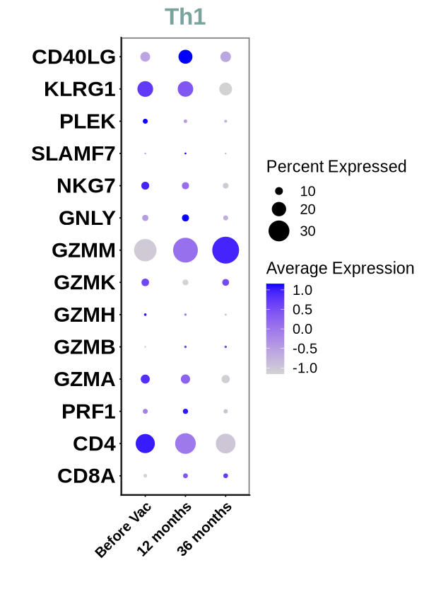
    


```R
jpeg(paste0(outdir, "RESULTS/PLOTS/DOTPLOT/", "Th1_cytolitic", ".png"), 
       width = 5, height = 6, units = 'in', res = 300)
p_th1_cyto
dev.off()
```


<strong>png:</strong> 2


```R
# save polarized CD4 T Cells 
#saveRDS(CD4_cells, "/Work/Users/bndao/UCPVAX_scRNA/WITHOUT_V4/CD4_T_CELLS/RESULTS/TABLES/CD4_cells_annotated.rds")
```

### Does  Markers of polarized Cell types  confirm our results ?


```R
CD4_cells <- readRDS("/Work/Users/bndao/UCPVAX_scRNA/WITHOUT_V4/CD4_T_CELLS/RESULTS/TABLES/CD4_cells_annotated.rds")
head(CD4_cells)
```


<table class="dataframe">
<caption>A data.frame: 10 × 38</caption>
<thead>
	<tr><th></th><th scope=col>orig.ident</th><th scope=col>nCount_RNA</th><th scope=col>nFeature_RNA</th><th scope=col>seq_folder</th><th scope=col>nUMI</th><th scope=col>nGene</th><th scope=col>Sample</th><th scope=col>TISSUE</th><th scope=col>ID</th><th scope=col>log10GenesPerUMI</th><th scope=col>⋯</th><th scope=col>predicted.celltype.l2</th><th scope=col>predicted.celltype.l3.score</th><th scope=col>predicted.celltype.l3</th><th scope=col>mapping.score</th><th scope=col>RNA_snn_res.0.3</th><th scope=col>RNA_snn_res.0.4</th><th scope=col>RNA_snn_res.0.5</th><th scope=col>RNA_snn_res.0.6</th><th scope=col>RNA_snn_res.0.8</th><th scope=col>CD4_cells_clusters</th></tr>
	<tr><th></th><th scope=col>&lt;chr&gt;</th><th scope=col>&lt;dbl&gt;</th><th scope=col>&lt;int&gt;</th><th scope=col>&lt;chr&gt;</th><th scope=col>&lt;dbl&gt;</th><th scope=col>&lt;int&gt;</th><th scope=col>&lt;fct&gt;</th><th scope=col>&lt;chr&gt;</th><th scope=col>&lt;chr&gt;</th><th scope=col>&lt;dbl&gt;</th><th scope=col>⋯</th><th scope=col>&lt;chr&gt;</th><th scope=col>&lt;dbl&gt;</th><th scope=col>&lt;chr&gt;</th><th scope=col>&lt;dbl&gt;</th><th scope=col>&lt;fct&gt;</th><th scope=col>&lt;fct&gt;</th><th scope=col>&lt;fct&gt;</th><th scope=col>&lt;fct&gt;</th><th scope=col>&lt;fct&gt;</th><th scope=col>&lt;fct&gt;</th></tr>
</thead>
<tbody>
	<tr><th scope=row>BSL_AAACCCAAGAATTGTG-1</th><td>BSL</td><td>3004</td><td>1065</td><td>UCPVAX_P23</td><td>3004</td><td>1065</td><td>Before Vac</td><td>BASELINE</td><td>P23</td><td>0.8705034</td><td>⋯</td><td>CD4 Naive</td><td>0.4672674</td><td>CD4 Naive</td><td>0.9076546</td><td>1</td><td>2</td><td>7</td><td>8</td><td>9 </td><td>1</td></tr>
	<tr><th scope=row>BSL_AAACCCAAGATCACCT-1</th><td>BSL</td><td>3280</td><td>1582</td><td>UCPVAX_P23</td><td>3280</td><td>1582</td><td>Before Vac</td><td>BASELINE</td><td>P23</td><td>0.9099321</td><td>⋯</td><td>CD4 TCM  </td><td>0.6200846</td><td>CD4 TCM_3</td><td>0.5767091</td><td>3</td><td>3</td><td>4</td><td>2</td><td>0 </td><td>3</td></tr>
	<tr><th scope=row>BSL_AAACCCAAGCAACAGC-1</th><td>BSL</td><td>3122</td><td>1546</td><td>UCPVAX_P23</td><td>3123</td><td>1547</td><td>Before Vac</td><td>BASELINE</td><td>P23</td><td>0.9126984</td><td>⋯</td><td>CD4 TCM  </td><td>0.9209200</td><td>CD4 TCM_1</td><td>0.2722068</td><td>4</td><td>5</td><td>1</td><td>4</td><td>11</td><td>4</td></tr>
	<tr><th scope=row>BSL_AAACCCAAGGATCATA-1</th><td>BSL</td><td>4024</td><td>1911</td><td>UCPVAX_P23</td><td>4024</td><td>1911</td><td>Before Vac</td><td>BASELINE</td><td>P23</td><td>0.9102835</td><td>⋯</td><td>CD4 TCM  </td><td>0.5647722</td><td>CD4 TCM_2</td><td>0.4511575</td><td>0</td><td>0</td><td>6</td><td>3</td><td>2 </td><td>0</td></tr>
	<tr><th scope=row>BSL_AAACCCACATCGCTGG-1</th><td>BSL</td><td>3923</td><td>1714</td><td>UCPVAX_P23</td><td>3925</td><td>1715</td><td>Before Vac</td><td>BASELINE</td><td>P23</td><td>0.8999467</td><td>⋯</td><td>CD4 TCM  </td><td>0.6132103</td><td>CD4 TCM_3</td><td>0.5165912</td><td>3</td><td>3</td><td>4</td><td>2</td><td>0 </td><td>3</td></tr>
	<tr><th scope=row>BSL_AAACCCAGTTTCGGCG-1</th><td>BSL</td><td>4522</td><td>1796</td><td>UCPVAX_P23</td><td>4522</td><td>1796</td><td>Before Vac</td><td>BASELINE</td><td>P23</td><td>0.8902906</td><td>⋯</td><td>CD4 TCM  </td><td>0.9349861</td><td>CD4 TCM_3</td><td>0.8983350</td><td>3</td><td>3</td><td>4</td><td>2</td><td>0 </td><td>3</td></tr>
	<tr><th scope=row>BSL_AAACCCATCTTTCCGG-1</th><td>BSL</td><td>2332</td><td>1161</td><td>UCPVAX_P23</td><td>2332</td><td>1161</td><td>Before Vac</td><td>BASELINE</td><td>P23</td><td>0.9100592</td><td>⋯</td><td>CD4 TCM  </td><td>0.9021856</td><td>CD4 TCM_1</td><td>0.4925671</td><td>2</td><td>1</td><td>3</td><td>0</td><td>6 </td><td>2</td></tr>
	<tr><th scope=row>BSL_AAACGAAAGGGTGAAA-1</th><td>BSL</td><td>1241</td><td> 766</td><td>UCPVAX_P23</td><td>1242</td><td> 767</td><td>Before Vac</td><td>BASELINE</td><td>P23</td><td>0.9323471</td><td>⋯</td><td>CD4 TCM  </td><td>0.4962507</td><td>CD4 TCM_1</td><td>0.2262777</td><td>4</td><td>5</td><td>1</td><td>4</td><td>11</td><td>4</td></tr>
	<tr><th scope=row>BSL_AAACGAACAACGGCTC-1</th><td>BSL</td><td>5804</td><td>2200</td><td>UCPVAX_P23</td><td>5804</td><td>2200</td><td>Before Vac</td><td>BASELINE</td><td>P23</td><td>0.8880618</td><td>⋯</td><td>CD4 TCM  </td><td>0.7265855</td><td>CD4 TCM_3</td><td>0.6868615</td><td>0</td><td>0</td><td>3</td><td>0</td><td>4 </td><td>0</td></tr>
	<tr><th scope=row>BSL_AAACGAATCGTGGGTC-1</th><td>BSL</td><td>9936</td><td>3449</td><td>UCPVAX_P23</td><td>9936</td><td>3449</td><td>Before Vac</td><td>BASELINE</td><td>P23</td><td>0.8850403</td><td>⋯</td><td>CD4 TCM  </td><td>0.4298799</td><td>CD4 TCM_1</td><td>0.4106024</td><td>3</td><td>3</td><td>4</td><td>2</td><td>0 </td><td>3</td></tr>
</tbody>
</table>


```R
levels(CD4_cells)
```


<style>
.list-inline {list-style: none; margin:0; padding: 0}
.list-inline>li {display: inline-block}
.list-inline>li:not(:last-child)::after {content: "\00b7"; padding: 0 .5ex}
</style>
<ol class=list-inline><li>'Th2'</li><li>'Tnaive'</li><li>'Th1'</li><li>'Treg'</li><li>'Tfh'</li></ol>


```R
#Idents(CD4_cells) <- "CD4_cells_clusters"
DefaultAssay(CD4_cells) <- "RNA"
CD4_cells.markers <- FindAllMarkers(CD4_cells, only.pos = TRUE, min.pct = 0.25, logfc.threshold = 0.25, verbose = FALSE) 
CD4_cells.markers %>%
    group_by(cluster) %>%
    top_n(n = 20, wt = avg_log2FC) -> CD4_cells.top20

```

    For a (much!) faster implementation of the Wilcoxon Rank Sum Test,
    (default method for FindMarkers) please install the presto package
    --------------------------------------------
    install.packages('devtools')
    devtools::install_github('immunogenomics/presto')
    --------------------------------------------
    After installation of presto, Seurat will automatically use the more 
    efficient implementation (no further action necessary).
    This message will be shown once per session
    


```R
write.table(x = CD4_cells.top20, file = paste0(outdir, "RESULTS/TABLES/", "CD4_cells.top20.tsv"), 
            quote = F, col.names = T, row.names = F, sep = "\t")
```


```R
CD4_cells.top20 |> knitr::kable()
```


    
    
    | p_val| avg_log2FC| pct.1| pct.2| p_val_adj|cluster |gene        |
    |-----:|----------:|-----:|-----:|---------:|:-------|:-----------|
    |     0|  1.3868832| 0.540| 0.215|         0|Th2     |ADAM19      |
    |     0|  1.1569776| 0.679| 0.356|         0|Th2     |PPP1R16B    |
    |     0|  1.2177346| 0.556| 0.262|         0|Th2     |FRY         |
    |     0|  1.0934729| 0.692| 0.403|         0|Th2     |NR3C1       |
    |     0|  1.6610472| 0.419| 0.171|         0|Th2     |GAB2        |
    |     0|  1.0853399| 0.548| 0.262|         0|Th2     |NIBAN1      |
    |     0|  1.5517824| 0.427| 0.183|         0|Th2     |SNED1       |
    |     0|  1.2218622| 0.552| 0.276|         0|Th2     |TIAM1       |
    |     0|  1.2337549| 0.439| 0.193|         0|Th2     |UST         |
    |     0|  1.2213215| 0.426| 0.192|         0|Th2     |EPHA4       |
    |     0|  1.1620401| 0.489| 0.246|         0|Th2     |PRKX        |
    |     0|  1.0408748| 0.481| 0.238|         0|Th2     |RAP1GAP2    |
    |     0|  0.9978060| 0.554| 0.304|         0|Th2     |SLC9A9      |
    |     0|  1.4881745| 0.277| 0.098|         0|Th2     |USP46       |
    |     0|  1.3185780| 0.359| 0.153|         0|Th2     |TGFBR3      |
    |     0|  1.3545341| 0.332| 0.139|         0|Th2     |ACVR2A      |
    |     0|  1.3977229| 0.333| 0.141|         0|Th2     |AP003086.1  |
    |     0|  1.2253754| 0.390| 0.186|         0|Th2     |TAFA1       |
    |     0|  1.0664854| 0.434| 0.238|         0|Th2     |AL589693.1  |
    |     0|  1.0951579| 0.367| 0.227|         0|Th2     |DLEU1       |
    |     0|  1.5819415| 0.861| 0.452|         0|Tnaive  |FHIT        |
    |     0|  2.5177805| 0.505| 0.134|         0|Tnaive  |IGF1R       |
    |     0|  1.4726753| 0.694| 0.364|         0|Tnaive  |TXK         |
    |     0|  1.5827488| 0.553| 0.262|         0|Tnaive  |CCR7        |
    |     0|  2.3438576| 0.272| 0.071|         0|Tnaive  |AK5         |
    |     0|  1.7522831| 0.394| 0.162|         0|Tnaive  |APBA2       |
    |     0|  1.2428872| 0.656| 0.424|         0|Tnaive  |MLLT3       |
    |     0|  1.4795922| 0.451| 0.206|         0|Tnaive  |CERS6       |
    |     0|  1.4888600| 0.459| 0.219|         0|Tnaive  |NUCB2       |
    |     0|  2.0260277| 0.293| 0.094|         0|Tnaive  |ADTRP       |
    |     0|  1.6969443| 0.378| 0.159|         0|Tnaive  |PCSK5       |
    |     0|  2.1464538| 0.254| 0.077|         0|Tnaive  |LEF1-AS1    |
    |     0|  1.6926045| 0.326| 0.140|         0|Tnaive  |PDK1        |
    |     0|  1.6747294| 0.286| 0.117|         0|Tnaive  |LRRN3       |
    |     0|  1.3737598| 0.376| 0.190|         0|Tnaive  |ATP10A      |
    |     0|  1.2330528| 0.447| 0.256|         0|Tnaive  |TRABD2A     |
    |     0|  1.5267783| 0.315| 0.145|         0|Tnaive  |SATB1-AS1   |
    |     0|  1.2318719| 0.450| 0.269|         0|Tnaive  |ITGA6       |
    |     0|  1.2048720| 0.415| 0.231|         0|Tnaive  |FAM117B     |
    |     0|  1.2868356| 0.280| 0.123|         0|Tnaive  |AIF1        |
    |     0|  1.0002059| 0.951| 0.745|         0|Th1     |S100A4      |
    |     0|  0.9970825| 0.776| 0.514|         0|Th1     |S100A11     |
    |     0|  2.1715457| 0.342| 0.103|         0|Th1     |KLRB1       |
    |     0|  0.7907867| 0.848| 0.671|         0|Th1     |CRIP1       |
    |     0|  0.7614737| 0.833| 0.654|         0|Th1     |S100A10     |
    |     0|  0.7991960| 0.788| 0.570|         0|Th1     |ANXA1       |
    |     0|  1.5035335| 0.341| 0.152|         0|Th1     |MYBL1       |
    |     0|  0.9380610| 0.495| 0.291|         0|Th1     |LGALS1      |
    |     0|  1.3734431| 0.257| 0.113|         0|Th1     |TNFRSF4     |
    |     0|  0.8996520| 0.490| 0.325|         0|Th1     |TRADD       |
    |     0|  0.9019406| 0.453| 0.297|         0|Th1     |TIMP1       |
    |     0|  0.8206226| 0.469| 0.324|         0|Th1     |PLP2        |
    |     0|  0.8229361| 0.353| 0.212|         0|Th1     |ANXA2       |
    |     0|  1.0048200| 0.310| 0.186|         0|Th1     |FKBP11      |
    |     0|  0.7908187| 0.401| 0.272|         0|Th1     |TXN         |
    |     0|  0.7717972| 0.475| 0.361|         0|Th1     |PDE4D       |
    |     0|  0.8831584| 0.364| 0.248|         0|Th1     |CMTM6       |
    |     0|  0.7924018| 0.339| 0.228|         0|Th1     |CD63        |
    |     0|  0.9274259| 0.365| 0.259|         0|Th1     |MAP3K4      |
    |     0|  0.8000514| 0.263| 0.188|         0|Th1     |DDIT4       |
    |     0|  4.6378832| 0.573| 0.051|         0|Treg    |IKZF2       |
    |     0|  3.8454488| 0.542| 0.079|         0|Treg    |TOX         |
    |     0|  3.2923254| 0.569| 0.121|         0|Treg    |LINC02694   |
    |     0|  2.9161024| 0.609| 0.178|         0|Treg    |STAM        |
    |     0|  3.3271831| 0.476| 0.095|         0|Treg    |RTKN2       |
    |     0|  4.6767338| 0.386| 0.028|         0|Treg    |AC093865.1  |
    |     0|  3.4920078| 0.380| 0.058|         0|Treg    |CTLA4       |
    |     0|  3.0836804| 0.386| 0.074|         0|Treg    |AC013652.1  |
    |     0|  2.9158191| 0.350| 0.073|         0|Treg    |TIGIT       |
    |     0|  3.3851279| 0.462| 0.138|         0|Treg    |AL136456.1  |
    |     0|  3.2662401| 0.256| 0.041|         0|Treg    |F5          |
    |     0|  3.0979582| 0.359| 0.093|         0|Treg    |TTN         |
    |     0|  3.3604037| 0.306| 0.069|         0|Treg    |HPGD        |
    |     0|  2.5778899| 0.355| 0.094|         0|Treg    |HLA-DRB1    |
    |     0|  2.9870615| 0.265| 0.055|         0|Treg    |CCDC141     |
    |     0|  2.5277351| 0.409| 0.133|         0|Treg    |IL2RA       |
    |     0|  2.7757367| 0.320| 0.086|         0|Treg    |MIR4435-2HG |
    |     0|  2.8149461| 0.369| 0.127|         0|Treg    |VAV3        |
    |     0|  2.4335946| 0.364| 0.126|         0|Treg    |CEP128      |
    |     0|  2.5357635| 0.268| 0.079|         0|Treg    |CDHR3       |
    |     0|  5.8765512| 0.952| 0.067|         0|Tfh     |LYN         |
    |     0|  5.6840486| 0.844| 0.046|         0|Tfh     |PLXDC2      |
    |     0|  5.8328573| 0.823| 0.037|         0|Tfh     |SLC8A1      |
    |     0|  5.8452959| 0.789| 0.031|         0|Tfh     |LRMDA       |
    |     0|  6.3022447| 0.633| 0.012|         0|Tfh     |FAM49A      |
    |     0|  5.5605595| 0.626| 0.017|         0|Tfh     |SYK         |
    |     0|  5.5021333| 0.605| 0.018|         0|Tfh     |IRAK3       |
    |     0|  5.5920394| 0.585| 0.014|         0|Tfh     |MEF2C       |
    |     0|  5.7610882| 0.571| 0.014|         0|Tfh     |DOCK5       |
    |     0|  5.6432301| 0.531| 0.011|         0|Tfh     |WDFY3       |
    |     0|  5.5219261| 0.517| 0.012|         0|Tfh     |RAB31       |
    |     0|  5.8016394| 0.490| 0.011|         0|Tfh     |ADGRE2      |
    |     0|  5.7404476| 0.408| 0.008|         0|Tfh     |CD86        |
    |     0|  5.7972261| 0.381| 0.006|         0|Tfh     |CSF2RA      |
    |     0|  5.5162150| 0.333| 0.006|         0|Tfh     |CHST15      |
    |     0|  6.0817110| 0.286| 0.005|         0|Tfh     |TNS3        |
    |     0|  5.6104928| 0.272| 0.004|         0|Tfh     |MYOF        |
    |     0|  5.5832635| 0.252| 0.005|         0|Tfh     |SIRPB2      |
    |     0|  5.4483321| 0.490| 0.023|         0|Tfh     |PID1        |
    |     0|  5.7214152| 0.252| 0.007|         0|Tfh     |CREB5       |


```R
table(rownames(CD4_cells) %in% CD4_cells.top20$gene)
```


    
    FALSE  TRUE 
    23595   100 


```R
# Scale the data in order to keep all gene of CD4_cells object 
CD4_cells_2 <- ScaleData(CD4_cells, features = rownames(CD4_cells))
```

    Centering and scaling data matrix
    


```R
options(repr.plot.width=15, repr.plot.height=15)
CD4_cells.signatures <- DoHeatmap(CD4_cells_2, features = CD4_cells.top20$gene, assay = "RNA") +
    ggtitle("CD4 T cell sub-population Signatures") + theme(plot.title = element_text(size = 20L, face = "bold", hjust = 0.5))

#CD4_cells.signatures
```

## Statistical Analysis

### Multiple group comparison (Cell type)


```R
# Does total number of polarized CD4 T cells is the same before reclustering (15000) ?

CD4_cells_stats <- ddply(CD4_cells@meta.data,~CD4_cells@active.ident+Sample, nrow)
names(CD4_cells_stats)[1:2] <- c("Celltype", "Sample")
CD4_cells_stats
```


<table class="dataframe">
<caption>A data.frame: 15 × 3</caption>
<thead>
	<tr><th scope=col>Celltype</th><th scope=col>Sample</th><th scope=col>V1</th></tr>
	<tr><th scope=col>&lt;fct&gt;</th><th scope=col>&lt;fct&gt;</th><th scope=col>&lt;int&gt;</th></tr>
</thead>
<tbody>
	<tr><td>Th2   </td><td>Before Vac</td><td>1762</td></tr>
	<tr><td>Th2   </td><td>12 months </td><td>1114</td></tr>
	<tr><td>Th2   </td><td>36 months </td><td> 783</td></tr>
	<tr><td>Tnaive</td><td>Before Vac</td><td>1271</td></tr>
	<tr><td>Tnaive</td><td>12 months </td><td>1689</td></tr>
	<tr><td>Tnaive</td><td>36 months </td><td>1537</td></tr>
	<tr><td>Th1   </td><td>Before Vac</td><td>1576</td></tr>
	<tr><td>Th1   </td><td>12 months </td><td>2211</td></tr>
	<tr><td>Th1   </td><td>36 months </td><td>1649</td></tr>
	<tr><td>Treg  </td><td>Before Vac</td><td> 475</td></tr>
	<tr><td>Treg  </td><td>12 months </td><td> 450</td></tr>
	<tr><td>Treg  </td><td>36 months </td><td> 336</td></tr>
	<tr><td>Tfh   </td><td>Before Vac</td><td>  87</td></tr>
	<tr><td>Tfh   </td><td>12 months </td><td>  39</td></tr>
	<tr><td>Tfh   </td><td>36 months </td><td>  21</td></tr>
</tbody>
</table>


```R
number_of_CD4_cells <- sum(CD4_cells_stats$V1)
paste0("The total number of polarized CD4 T cells is ", number_of_CD4_cells)
```


'The total number of polarized CD4 T cells is 15000'


```R
# outliers
CD4_cells_stats %>% 
    group_by(Sample) %>%
  identify_outliers(V1)
```


<table class="dataframe">
<caption>A data.frame: 0 × 5</caption>
<thead>
	<tr><th scope=col>Sample</th><th scope=col>Celltype</th><th scope=col>V1</th><th scope=col>is.outlier</th><th scope=col>is.extreme</th></tr>
	<tr><th scope=col>&lt;fct&gt;</th><th scope=col>&lt;fct&gt;</th><th scope=col>&lt;int&gt;</th><th scope=col>&lt;lgl&gt;</th><th scope=col>&lt;lgl&gt;</th></tr>
</thead>
<tbody>
</tbody>
</table>


```R
# Normality test

shapiro.test(CD4_cells_stats$V1)
```


    
    	Shapiro-Wilk normality test
    
    data:  CD4_cells_stats$V1
    W = 0.9173, p-value = 0.1752


```R
CD4_cells_stats %>% 
    group_by(Sample) %>%
    shapiro_test(V1)
```


<table class="dataframe">
<caption>A tibble: 3 × 4</caption>
<thead>
	<tr><th scope=col>Sample</th><th scope=col>variable</th><th scope=col>statistic</th><th scope=col>p</th></tr>
	<tr><th scope=col>&lt;fct&gt;</th><th scope=col>&lt;chr&gt;</th><th scope=col>&lt;dbl&gt;</th><th scope=col>&lt;dbl&gt;</th></tr>
</thead>
<tbody>
	<tr><td>Before Vac</td><td>V1</td><td>0.9102323</td><td>0.4689874</td></tr>
	<tr><td>12 months </td><td>V1</td><td>0.9703297</td><td>0.8773658</td></tr>
	<tr><td>36 months </td><td>V1</td><td>0.9113792</td><td>0.4759226</td></tr>
</tbody>
</table>


#### From the output, the p-value > 0.05 implying that the variance of the data are not significantly different from normal distribution


```R
# check variance homogeneity
CD4_cells_stats %>%
    levene_test(V1 ~ Sample)
```


<table class="dataframe">
<caption>A tibble: 1 × 4</caption>
<thead>
	<tr><th scope=col>df1</th><th scope=col>df2</th><th scope=col>statistic</th><th scope=col>p</th></tr>
	<tr><th scope=col>&lt;int&gt;</th><th scope=col>&lt;int&gt;</th><th scope=col>&lt;dbl&gt;</th><th scope=col>&lt;dbl&gt;</th></tr>
</thead>
<tbody>
	<tr><td>2</td><td>12</td><td>0.1398482</td><td>0.8708868</td></tr>
</tbody>
</table>


```R
# check variance homogeneity
CD4_cells_stats %>%
    levene_test(V1 ~ Celltype)
```


<table class="dataframe">
<caption>A tibble: 1 × 4</caption>
<thead>
	<tr><th scope=col>df1</th><th scope=col>df2</th><th scope=col>statistic</th><th scope=col>p</th></tr>
	<tr><th scope=col>&lt;int&gt;</th><th scope=col>&lt;int&gt;</th><th scope=col>&lt;dbl&gt;</th><th scope=col>&lt;dbl&gt;</th></tr>
</thead>
<tbody>
	<tr><td>4</td><td>10</td><td>1.057412</td><td>0.4261543</td></tr>
</tbody>
</table>


```R
#Normality of data is checked, then anova tets is best
stat.test_1 <- CD4_cells_stats |>
    anova_test(V1 ~Celltype+Sample) |>
    adjust_pvalue()
stat.test_1
```


<table class="dataframe">
<caption>A anova_test: 2 × 8</caption>
<thead>
	<tr><th></th><th scope=col>Effect</th><th scope=col>DFn</th><th scope=col>DFd</th><th scope=col>F</th><th scope=col>p</th><th scope=col>p&lt;.05</th><th scope=col>ges</th><th scope=col>p.adj</th></tr>
	<tr><th></th><th scope=col>&lt;chr&gt;</th><th scope=col>&lt;dbl&gt;</th><th scope=col>&lt;dbl&gt;</th><th scope=col>&lt;dbl&gt;</th><th scope=col>&lt;dbl&gt;</th><th scope=col>&lt;chr&gt;</th><th scope=col>&lt;dbl&gt;</th><th scope=col>&lt;dbl&gt;</th></tr>
</thead>
<tbody>
	<tr><th scope=row>1</th><td>Celltype</td><td>4</td><td>8</td><td>19.023</td><td>0.000378</td><td>*</td><td>0.905</td><td>0.000756</td></tr>
	<tr><th scope=row>2</th><td>Sample  </td><td>2</td><td>8</td><td> 0.850</td><td>0.463000</td><td> </td><td>0.175</td><td>0.463000</td></tr>
</tbody>
</table>


```R
# Tukey tets (comparison per paire)
pwc <- CD4_cells_stats %>%
    tukey_hsd(V1 ~ Celltype+Sample) %>%
    adjust_pvalue(method = "bonferroni")
pwc
```


<table class="dataframe">
<caption>A rstatix_test: 13 × 9</caption>
<thead>
	<tr><th></th><th scope=col>term</th><th scope=col>group1</th><th scope=col>group2</th><th scope=col>null.value</th><th scope=col>estimate</th><th scope=col>conf.low</th><th scope=col>conf.high</th><th scope=col>p.adj</th><th scope=col>p.adj.signif</th></tr>
	<tr><th></th><th scope=col>&lt;chr&gt;</th><th scope=col>&lt;chr&gt;</th><th scope=col>&lt;chr&gt;</th><th scope=col>&lt;dbl&gt;</th><th scope=col>&lt;dbl&gt;</th><th scope=col>&lt;dbl&gt;</th><th scope=col>&lt;dbl&gt;</th><th scope=col>&lt;dbl&gt;</th><th scope=col>&lt;chr&gt;</th></tr>
</thead>
<tbody>
	<tr><th scope=row>1</th><td>Celltype</td><td>Th2       </td><td>Tnaive   </td><td>0</td><td>  279.3333</td><td> -550.8653</td><td>1109.53194</td><td>0.771000</td><td>ns </td></tr>
	<tr><th scope=row>2</th><td>Celltype</td><td>Th2       </td><td>Th1      </td><td>0</td><td>  592.3333</td><td> -237.8653</td><td>1422.53194</td><td>0.192000</td><td>ns </td></tr>
	<tr><th scope=row>3</th><td>Celltype</td><td>Th2       </td><td>Treg     </td><td>0</td><td> -799.3333</td><td>-1629.5319</td><td>  30.86528</td><td>0.059600</td><td>ns </td></tr>
	<tr><th scope=row>4</th><td>Celltype</td><td>Th2       </td><td>Tfh      </td><td>0</td><td>-1170.6667</td><td>-2000.8653</td><td>-340.46806</td><td>0.007940</td><td>** </td></tr>
	<tr><th scope=row>5</th><td>Celltype</td><td>Tnaive    </td><td>Th1      </td><td>0</td><td>  313.0000</td><td> -517.1986</td><td>1143.19861</td><td>0.697000</td><td>ns </td></tr>
	<tr><th scope=row>6</th><td>Celltype</td><td>Tnaive    </td><td>Treg     </td><td>0</td><td>-1078.6667</td><td>-1908.8653</td><td>-248.46806</td><td>0.012800</td><td>*  </td></tr>
	<tr><th scope=row>7</th><td>Celltype</td><td>Tnaive    </td><td>Tfh      </td><td>0</td><td>-1450.0000</td><td>-2280.1986</td><td>-619.80139</td><td>0.002080</td><td>** </td></tr>
	<tr><th scope=row>8</th><td>Celltype</td><td>Th1       </td><td>Treg     </td><td>0</td><td>-1391.6667</td><td>-2221.8653</td><td>-561.46806</td><td>0.002710</td><td>** </td></tr>
	<tr><th scope=row>9</th><td>Celltype</td><td>Th1       </td><td>Tfh      </td><td>0</td><td>-1763.0000</td><td>-2593.1986</td><td>-932.80139</td><td>0.000554</td><td>***</td></tr>
	<tr><th scope=row>10</th><td>Celltype</td><td>Treg      </td><td>Tfh      </td><td>0</td><td> -371.3333</td><td>-1201.5319</td><td> 458.86528</td><td>0.565000</td><td>ns </td></tr>
	<tr><th scope=row>11</th><td>Sample  </td><td>Before Vac</td><td>12 months</td><td>0</td><td>   66.4000</td><td> -465.4863</td><td> 598.28627</td><td>0.933000</td><td>ns </td></tr>
	<tr><th scope=row>12</th><td>Sample  </td><td>Before Vac</td><td>36 months</td><td>0</td><td> -169.0000</td><td> -700.8863</td><td> 362.88627</td><td>0.651000</td><td>ns </td></tr>
	<tr><th scope=row>13</th><td>Sample  </td><td>12 months </td><td>36 months</td><td>0</td><td> -235.4000</td><td> -767.2863</td><td> 296.48627</td><td>0.452000</td><td>ns </td></tr>
</tbody>
</table>


### Does cell proportion and vaccine time independant ?


```R
# Find Cell number from the seurat object CD4_cells
CD4_cells_stats <- ddply(CD4_cells@meta.data,~CD4_cells@active.ident+Sample, nrow)
names(CD4_cells_stats)[1:2] <- c("Celltype", "Sample")
CD4_cells_stats
```


<table class="dataframe">
<caption>A data.frame: 15 × 3</caption>
<thead>
	<tr><th scope=col>Celltype</th><th scope=col>Sample</th><th scope=col>V1</th></tr>
	<tr><th scope=col>&lt;fct&gt;</th><th scope=col>&lt;fct&gt;</th><th scope=col>&lt;int&gt;</th></tr>
</thead>
<tbody>
	<tr><td>Th2   </td><td>Before Vac</td><td>1762</td></tr>
	<tr><td>Th2   </td><td>12 months </td><td>1114</td></tr>
	<tr><td>Th2   </td><td>36 months </td><td> 783</td></tr>
	<tr><td>Tnaive</td><td>Before Vac</td><td>1271</td></tr>
	<tr><td>Tnaive</td><td>12 months </td><td>1689</td></tr>
	<tr><td>Tnaive</td><td>36 months </td><td>1537</td></tr>
	<tr><td>Th1   </td><td>Before Vac</td><td>1576</td></tr>
	<tr><td>Th1   </td><td>12 months </td><td>2211</td></tr>
	<tr><td>Th1   </td><td>36 months </td><td>1649</td></tr>
	<tr><td>Treg  </td><td>Before Vac</td><td> 475</td></tr>
	<tr><td>Treg  </td><td>12 months </td><td> 450</td></tr>
	<tr><td>Treg  </td><td>36 months </td><td> 336</td></tr>
	<tr><td>Tfh   </td><td>Before Vac</td><td>  87</td></tr>
	<tr><td>Tfh   </td><td>12 months </td><td>  39</td></tr>
	<tr><td>Tfh   </td><td>36 months </td><td>  21</td></tr>
</tbody>
</table>


```R
# Transform the data in order to apply the chi-square test
df <- reshape(CD4_cells_stats, direction = "wide", idvar = "Celltype", timevar = c("Sample")) 
rownames(df) <- NULL
df <- df |>
    column_to_rownames(var = "Celltype")
df
```


<table class="dataframe">
<caption>A data.frame: 5 × 3</caption>
<thead>
	<tr><th></th><th scope=col>V1.Before Vac</th><th scope=col>V1.12 months</th><th scope=col>V1.36 months</th></tr>
	<tr><th></th><th scope=col>&lt;int&gt;</th><th scope=col>&lt;int&gt;</th><th scope=col>&lt;int&gt;</th></tr>
</thead>
<tbody>
	<tr><th scope=row>Th2</th><td>1762</td><td>1114</td><td> 783</td></tr>
	<tr><th scope=row>Tnaive</th><td>1271</td><td>1689</td><td>1537</td></tr>
	<tr><th scope=row>Th1</th><td>1576</td><td>2211</td><td>1649</td></tr>
	<tr><th scope=row>Treg</th><td> 475</td><td> 450</td><td> 336</td></tr>
	<tr><th scope=row>Tfh</th><td>  87</td><td>  39</td><td>  21</td></tr>
</tbody>
</table>


```R
# Apply the chi-square test
khi <- chisq.test(df)
khi
```


    
    	Pearson's Chi-squared test
    
    data:  df
    X-squared = 525.75, df = 8, p-value < 2.2e-16


```R
paste0(" p-value of the chi-square test = ",  khi$p.value)
```


' p-value of the chi-square test = 2.09771725221201e-108'


#### According to the p-value(<0.05) independence hypoyhesis is rejected, than vaccine time and Celltype abundance are dependant

### Calcul of cell proportion at each time


```R
df_Th2 <- CD4_cells_stats |>
    filter(Celltype == "Th2")
number_of_Th2 <- sum(df_Th2$V1)
paste0("Number of Th2 cells is :", number_of_Th2)

df_Tnaive <- CD4_cells_stats |>
    filter(Celltype == "Tnaive")
number_of_Tnaive <- sum(df_Tnaive$V1)
paste0("Number of naive T cells is :", number_of_Tnaive)

df_Th1 <- CD4_cells_stats |>
    filter(Celltype == "Th1")
number_of_Th1 <- sum(df_Th1$V1)
paste0("Number of Th1 cells is :", number_of_Th1)


df_Treg <- CD4_cells_stats |>
    filter(Celltype == "Treg")
number_of_Treg <- sum(df_Treg$V1)
paste0("Number of Treg cells is :", number_of_Treg)


df_Tfh <- CD4_cells_stats |>
    filter(Celltype == "Tfh")
number_of_Tfh <- sum(df_Tfh$V1)
paste0("Number of Tfh cells is :", number_of_Tfh)

```


'Number of Th2 cells is :3659'


'Number of naive T cells is :4497'


'Number of Th1 cells is :5436'


'Number of Treg cells is :1261'


'Number of Tfh cells is :147'


```R
CD4_cells_stats <- CD4_cells_stats |>
    mutate(
        Proportion = case_when(
           Celltype == "Th2" ~  as.integer(100*V1/number_of_Th2),
           Celltype == "Tnaive" ~  as.integer(100*V1/number_of_Tnaive),
           Celltype == "Th1" ~  as.integer(100*V1/number_of_Th1),
           Celltype == "Treg" ~  as.integer(100*V1/number_of_Treg),
           Celltype == "Tfh" ~  as.integer(100*V1/number_of_Tfh)
        )
    )
CD4_cells_stats
```


<table class="dataframe">
<caption>A data.frame: 15 × 4</caption>
<thead>
	<tr><th scope=col>Celltype</th><th scope=col>Sample</th><th scope=col>V1</th><th scope=col>Proportion</th></tr>
	<tr><th scope=col>&lt;fct&gt;</th><th scope=col>&lt;fct&gt;</th><th scope=col>&lt;int&gt;</th><th scope=col>&lt;int&gt;</th></tr>
</thead>
<tbody>
	<tr><td>Th2   </td><td>Before Vac</td><td>1762</td><td>48</td></tr>
	<tr><td>Th2   </td><td>12 months </td><td>1114</td><td>30</td></tr>
	<tr><td>Th2   </td><td>36 months </td><td> 783</td><td>21</td></tr>
	<tr><td>Tnaive</td><td>Before Vac</td><td>1271</td><td>28</td></tr>
	<tr><td>Tnaive</td><td>12 months </td><td>1689</td><td>37</td></tr>
	<tr><td>Tnaive</td><td>36 months </td><td>1537</td><td>34</td></tr>
	<tr><td>Th1   </td><td>Before Vac</td><td>1576</td><td>28</td></tr>
	<tr><td>Th1   </td><td>12 months </td><td>2211</td><td>40</td></tr>
	<tr><td>Th1   </td><td>36 months </td><td>1649</td><td>30</td></tr>
	<tr><td>Treg  </td><td>Before Vac</td><td> 475</td><td>37</td></tr>
	<tr><td>Treg  </td><td>12 months </td><td> 450</td><td>35</td></tr>
	<tr><td>Treg  </td><td>36 months </td><td> 336</td><td>26</td></tr>
	<tr><td>Tfh   </td><td>Before Vac</td><td>  87</td><td>59</td></tr>
	<tr><td>Tfh   </td><td>12 months </td><td>  39</td><td>26</td></tr>
	<tr><td>Tfh   </td><td>36 months </td><td>  21</td><td>14</td></tr>
</tbody>
</table>


### Statistical vizualisation


```R
options(repr.plot.width=12, repr.plot.height=8) # Gère la taille des figures dans le notebook
# combine plot and statistical test with ggbarstats
#library(ggstatsplot) 
p_bar <- ggbarstats(
  data = CD4_cells_stats,
  x = Sample,
  y = Celltype,
  counts = V1, 
  label.args = list(alpha = 1, fill = "white", size = 7),
  results.subtitle = TRUE,
  type = "parametric",
  paired = TRUE,
  pairwise_prop_test = TRUE,
  bf.message = TRUE,
  sampling.plan = "hypergeom",
  subtitle = paste0(
    "Chi-square test", ", p-value = ",
    khi$p.value, " ----> ", round(khi$p.value) 
  )
) + 
    #scale_fill_manual(values = c(HD = "gray", RC = "gold3", PD2 = "aquamarine4", PD1 = "darkorange1")) +
    theme(
    legend.position = "right",
    legend.title = element_text(size=14L, face = "bold"), #change legend title font size
    legend.text = element_text(size=12L, face = "bold"), #change legend text font size
    plot.title = element_text(size = 14L,face = "bold", hjust = 0.5),
    plot.subtitle = element_text(size = 12L,face = "bold"),
    axis.title.y = element_text(size = 14L,face = "bold"),
    axis.title.x = element_text(size = 0),
    axis.text.x = element_text(size = 12L,face = "bold", angle = 15),
    axis.text.y = element_text(size = 12L,face = "bold"),
    strip.text = element_text(size = 10, face = "bold")
   ) #+
    #coord_flip()
p_bar
```


    
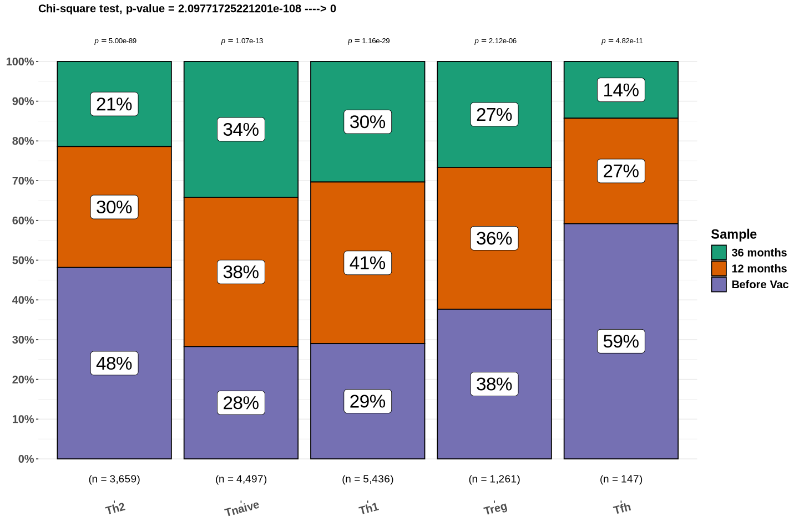
    


```R
jpeg(paste0(outdir, "RESULTS/PLOTS/BARPLOT/", "Polarized_CD4_T_cells_Stats", ".png"), 
       width = 12, height = 8, units = 'in', res = 300)
p_bar
dev.off()
```


```R
sessionInfo()
```


    R version 4.2.3 (2023-03-15)
    Platform: x86_64-conda-linux-gnu (64-bit)
    Running under: Rocky Linux 8.7 (Green Obsidian)
    
    Matrix products: default
    BLAS/LAPACK: /Work/Users/bndao/.conda/envs/jupyter/lib/libopenblasp-r0.3.21.so
    
    locale:
     [1] LC_CTYPE=en_US.UTF-8       LC_NUMERIC=C              
     [3] LC_TIME=en_US.UTF-8        LC_COLLATE=en_US.UTF-8    
     [5] LC_MONETARY=en_US.UTF-8    LC_MESSAGES=en_US.UTF-8   
     [7] LC_PAPER=en_US.UTF-8       LC_NAME=C                 
     [9] LC_ADDRESS=C               LC_TELEPHONE=C            
    [11] LC_MEASUREMENT=en_US.UTF-8 LC_IDENTIFICATION=C       
    
    attached base packages:
    [1] grid      stats     graphics  grDevices utils     datasets  methods  
    [8] base     
    
    other attached packages:
     [1] rstatix_0.7.2      PMCMRplus_1.9.6    ggstatsplot_0.11.1 ggpubr_0.6.0      
     [5] ggrepel_0.9.3      openxlsx_4.2.5.2   lubridate_1.9.2    forcats_1.0.0     
     [9] stringr_1.5.1      dplyr_1.1.3        purrr_1.0.2        readr_2.1.4       
    [13] tidyr_1.3.0        tibble_3.2.1       ggplot2_3.5.0      tidyverse_2.0.0   
    [17] Matrix_1.6-3       reshape_0.8.9      pals_1.7           cowplot_1.1.1     
    [21] gridExtra_2.3      plyr_1.8.8         RColorBrewer_1.1-3 patchwork_1.1.3   
    [25] SeuratObject_5.0.1 Seurat_4.4.0      
    
    loaded via a namespace (and not attached):
      [1] utf8_1.2.3             spatstat.explore_3.2-1 reticulate_1.30       
      [4] tidyselect_1.2.0       htmlwidgets_1.6.2      gmp_0.7-1             
      [7] Rtsne_0.16             munsell_0.5.0          codetools_0.2-19      
     [10] effectsize_0.8.3       ica_1.0-3              pbdZMQ_0.3-9          
     [13] future_1.33.0          miniUI_0.1.1.1         withr_3.0.0           
     [16] spatstat.random_3.1-5  colorspace_2.1-0       progressr_0.14.0      
     [19] uuid_1.1-0             rstudioapi_0.15.0      ROCR_1.0-11           
     [22] ggsignif_0.6.4         tensor_1.5             listenv_0.9.0         
     [25] labeling_0.4.3         emmeans_1.8.6          repr_1.1.6            
     [28] polyclip_1.10-4        farver_2.1.1           datawizard_0.7.1      
     [31] coda_0.19-4            parallelly_1.36.0      vctrs_0.6.3           
     [34] generics_0.1.3         TH.data_1.1-2          timechange_0.2.0      
     [37] BWStest_0.2.2          R6_2.5.1               spatstat.utils_3.0-3  
     [40] cachem_1.0.8           promises_1.2.0.1       scales_1.3.0          
     [43] multcomp_1.4-25        gtable_0.3.4           multcompView_0.1-9    
     [46] globals_0.16.2         goftest_1.2-3          spam_2.10-0           
     [49] sandwich_3.0-2         rlang_1.1.1            zeallot_0.1.0         
     [52] splines_4.2.3          lazyeval_0.2.2         dichromat_2.0-0.1     
     [55] spatstat.geom_3.2-4    broom_1.0.5            prismatic_1.1.1       
     [58] reshape2_1.4.4         abind_1.4-5            backports_1.4.1       
     [61] httpuv_1.6.11          tools_4.2.3            ellipsis_0.3.2        
     [64] ggridges_0.5.4         Rcpp_1.0.11            base64enc_0.1-3       
     [67] deldir_1.0-9           pbapply_1.7-2          correlation_0.8.4     
     [70] zoo_1.8-12             cluster_2.1.4          magrittr_2.0.3        
     [73] data.table_1.14.8      scattermore_1.2        lmtest_0.9-40         
     [76] RANN_2.6.1             mvtnorm_1.1-3          fitdistrplus_1.1-11   
     [79] matrixStats_1.0.0      hms_1.1.3              mime_0.12             
     [82] evaluate_0.23          xtable_1.8-4           compiler_4.2.3        
     [85] maps_3.4.1             KernSmooth_2.23-21     crayon_1.5.2          
     [88] htmltools_0.5.5        later_1.3.1            tzdb_0.4.0            
     [91] SuppDists_1.1-9.7      kSamples_1.2-9         MASS_7.3-60           
     [94] car_3.1-2              cli_3.6.1              parallel_4.2.3        
     [97] insight_0.19.1         dotCall64_1.1-0        igraph_2.0.2          
    [100] pkgconfig_2.0.3        statsExpressions_1.5.0 sp_2.0-0              
    [103] IRdisplay_1.1          plotly_4.10.3          spatstat.sparse_3.0-2 
    [106] paletteer_1.5.0        estimability_1.4.1     digest_0.6.33         
    [109] sctransform_0.4.1      RcppAnnoy_0.0.21       parameters_0.21.0     
    [112] spatstat.data_3.0-3    leiden_0.4.3           uwot_0.1.16           
    [115] shiny_1.8.0            lifecycle_1.0.4        nlme_3.1-162          
    [118] jsonlite_1.8.7         carData_3.0-5          mapproj_1.2.11        
    [121] viridisLite_0.4.2      fansi_1.0.4            pillar_1.9.0          
    [124] lattice_0.21-8         fastmap_1.1.1          httr_1.4.7            
    [127] survival_3.5-5         glue_1.6.2             bayestestR_0.13.1     
    [130] zip_2.3.0              png_0.1-8              stringi_1.8.3         
    [133] rematch2_2.1.2         memoise_2.0.1          IRkernel_1.3.2        
    [136] Rmpfr_0.9-2            irlba_2.3.5.1          future.apply_1.11.0   


```R

```
